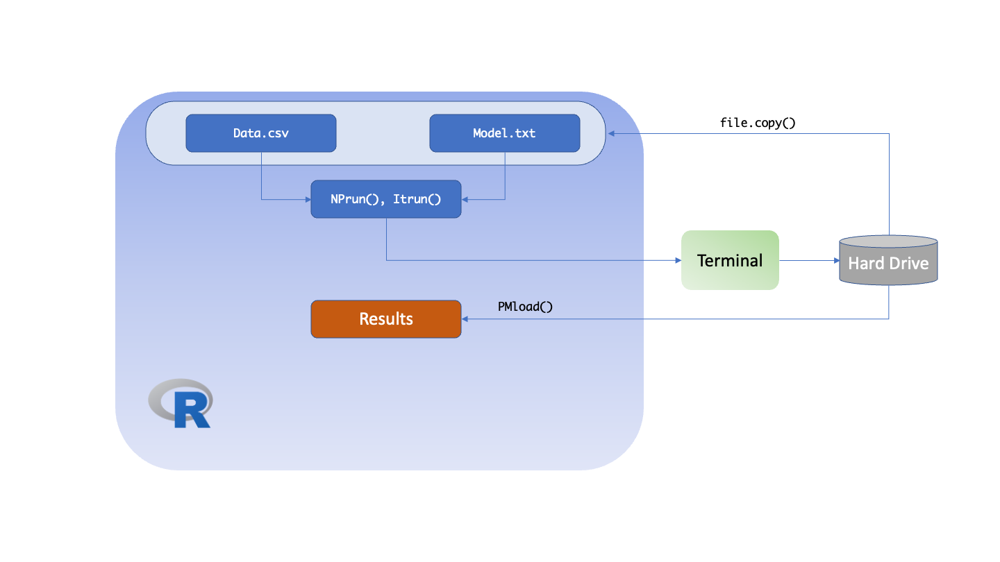

# General Workflow

R6

The general Pmetrics workflow in R6 for IT2B and NPAG is shown in the
following diagram.

The user supplies the items in **yellow**. R is used to specify the working directory containing the data .csv file. The model file is created in R using
the `PM_model` function. When combined using `PM_fit` and the `$run()` function
on the resulting object, a batch file is generated by R, causing the preparation
program to be compiled and executed. An instruction file is generated
automatically by the contents of the data and model, and by
arguments to the `$run()` function. The batch file
will then compile and execute the engine file according to the
instructions, which will generate several output files upon completion.
Finally, the batch file will call the R script to generate the summary
report and several data objects, including the IT2Bout.Rdata or
NPAGout.Rdata files which can be loaded into R subsequently using
`PM_load`. Objects that are modified can be saved back to the .Rdata
files with `PMsave`.

Legacy

The general Pmetrics workflow in Legacy for IT2B and NPAG is shown in the
following diagram. The major differences compared to R6 are that the model is a text file, and the commands to start the run are different.

The user supplies the items in **yellow** as arguments to 
the run functions. R is used to specify the working directory containing the data.csv and
model.txt files. Through the batch file generated by R, the preparation
program is compiled and executed. The instruction file is generated
automatically by the contents of the data and model files, and by
arguments to the `NPrun`, `ITrun` or `ERRrun` commands. The batch file
will then compile and execute the engine file according to the
instructions, which will generate several output files upon completion.
Finally, the batch file will call the R script to generate the summary
report and several data objects, including the IT2Bout.Rdata or
NPAGout.Rdata files which can be loaded into R subsequently using
`PMload`. Objects that are modified can be saved back to the .Rdata
files with `PMsave`.

`PMload` is aliased as `PM_load` for consistency with the above functions.
Similar to the Legacy version, it loads the results of a run into R to be 
accessible to the user for analysis, plotting, etc. Different from the Legacy
version, it loads the results into another R6 object, `PM_result` instead of
the current environment.  

Both input files (data, model) are text files which can be edited
directly.