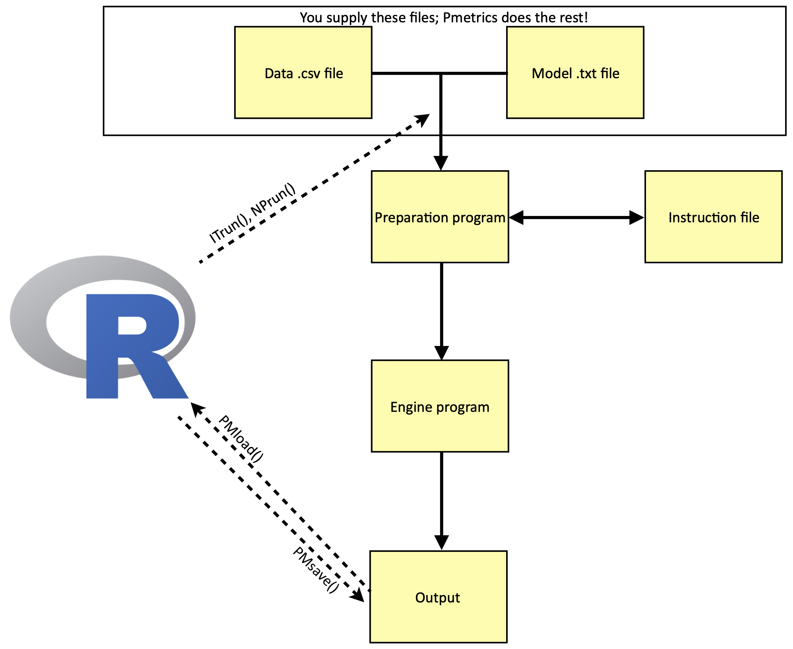

```{r setup, include=FALSE}
knitr::opts_chunk$set(echo = TRUE)
options(knitr.kable.NA = ".")
```

```{css echo=F}
h1 {
  color:#446e9b
}
```

# Introduction 

Thank you for your interest in Pmetrics! This guide provides
instructions and examples to assist users of the Pmetrics R package, by
the Laboratory of Applied Pharmacokinetics and Bioinformatics at the
Saban Research Institute, Children's Hospital Los Angeles, and the
Department of Pediatrics, Keck School of Medicine, University of
Southern California. Please see our website at
[[http://www.lapk.org]{.underline}](http://www.lapk.org) for more
information.

As of *v. 2.0*, Pmetrics is shifting to an architecture less dependent on
reading and writing files. Data files are unchanged and described later in
this manual.

Model files can now be defined as an R object, instead of in a text file. 
Pmetrics can suppoort legacy runs with the old-style text file models, but
users are encouraged to change to the new methods. Throughout this manual we
will indicate the new style with the **R6** designation to reflect the
object-oriented R6 style of programming available in R that makes it more
consistent with object-oriented languages such as Python. We will indicate
old-style approaches with **Legacy**.


**Here are some tips for using this guide.**

* The table of contents to the left is expandable and navigable.

* Items that are hyperlinked can be selected to cross reference
within this manual or link to external sites.

* `Items` correspond to inline examples of R code, which are not evaluted
in this document, but serve as templates for what may be typed into your 
R console or script. They may not necessarily be executable if typed verbatim.

## Citing Pmetrics

Please help us maintain our funding to provide Pmetrics as a free
research tool to the pharmacometric community. If you use Pmetrics in a
publication, you can cite it as below.

```{r} 
citation("Pmetrics")
```

## Disclaimer

You, the user, assume all responsibility for acting on the results
obtained from Pmetrics. The Laboratory of Applied Pharmacokinetics and
Bioinformatics (LAPKB), members and consultants to LAPKB, and Children's
Hospital Los Angeles and the University of Southern California and their
employees assume no liability whatsoever. Your use of the package
constitutes your agreement to this provision.

## System Requirements and Installation


Pmetrics and all required components will run under Mac (Unix), Windows,
and Linux. There are three *required* software components
which must be installed on your system **in this order**:

1.  The statistical programming language and environment "**R**"
    + After installing R, we highly recommended that you also install
**Rstudio**, a user-friendly environment for R.

2.  The **Pmetrics** package for R

3.  The **gfortran** Fortran compiler.

 
All components have versions for Mac, Windows, and Linux environments,
and 64- bit processors. Systems with 32-bit processors are no longer
supported. All are free of charge.

#### R

R is a free software environment for statistical computing and graphics,
which can be obtained from
[[http://www.R-project.org]{.underline}](http://www.R-project.org)/.
Pmetrics is a library for R.

#### Rstudio

We strongly recommend using [Rstudio](http://rstudio.org/) rather than any
other R interface.

#### Pmetrics

If you are reading this manual, then you have likely visited our website
at [[http://www.lapk.org]{.underline}](http://www.lapk.org), where you
can select the software tab to access instructions. 
As of version 1.9, Pmetrics is distributed on github and is a self-contained
package that will install gfortran with your permission, if it is not
already installed on your computer. Installing from github will also install
all packages upon which Pmetrics depends.


#### Gfortran

In order to run Pmetrics, a Fortran compiler compiler is required.
Pmetrics is designed to work with gfortran, a free compiler. After you
have installed Pmetrics, it will check your system for an active
gfortran installation. If it doesn't find one, it will offer to download
and install it. From there, installation should proceed automatically.
This is by far the easiest and most reliable way to complete
installation. Rest assured that no files are installed without your
permission.

If you do not wish to do this, you will have to get components manually,
and the first command to run is `PMbuild()`. You can get detailed
instructions on how to obtain and install gfortran appropriate for your
system on our [LAPKB website](http://www.lapk.org/Pmetrics_install_manual.php).

## What This Manual Is Not

We assume that the user has familiarity with population modeling and R,
and thus this manual is not a tutorial for basic concepts and techniques
in either domain. We have tried to make the R code simple, regular and
well documented. A very good free online resource for learning the
basics of R can be found at [Stat Methods](http://www.statmethods.net/index.html).

We recognize that initial use of a new software package can be complex,
so please feel free to contact us at any time, preferably through the
[Pmetrics forum](http:/www.lapk.org) or directly by [email](mailto:contact@lapk.org).

This manual is also not intended to be a theoretical treatise on the
algorithms used in IT2B or NPAG. For that, the user is directed to our
[website](http://www.lapk.org).

## Getting Help and Updates

<!--There is an active [LAPK forum](http://www.lapk.org) with all kinds
of useful tips and help with Pmetrics. Register and feel free to post! 
-->
Within R, you can  use
`help("command")` or `?command` in the R console to see detailed help files
for any Pmetrics command. Many commands have examples included in this
documentation and you can execute the examples with `example(command)`.

<!--You can also type `PMmanual()` to launch this manual from within Pmetrics 
as well as a catalogue of all Pmetrics functions. Finally, 
`PMnews()` will display the Pmetrics change log.
-->

Pmetrics will check for updates automatically every time you load it
with `library(Pmetrics)` and you are connected to the internet. 
If an update is available, it will provide a
brief message to inform you. You can then reinstall the package from github.

<!--When bugs arise in Pmetrics, you may see a start up message to inform you of 
the bug and a patch can be installed by the command `PMpatch()` if available. 
Note that patches must be reinstalled with this command every time you launch
Pmetrics, until the bug is corrected in the next version.
-->

<!--As of version 1.0.0 Pmetrics has graphical user interface (GUI)
capability for many functions. Using `PMcode("function")` will launch the
GUI in your default browser. While you are interacting with the GUI, R
is "listening" and no other activity is possible. The GUI is designed to
generate Pmetrics R code in response to your input in a friendly,
intuitive environment. That code can be copied and pasted into your
Pmetrics R script. You can also see live plot previews with the GUI. All
this is made possible with the 'shiny' package for R.


Currently, the following GUIs are available: `PMcode("run")` and
`PMcode("plot")`. 
--> 

## Customizing Pmetrics Options

You can change global options in Pmetrics with 
`setPMoptions(sep, dec,server\_address)`.

Currently you can change three options: `sep` and `dec` will allow Pmetrics
to read data files whose field separators are semicolons and decimal
separators are commas, e.g. `setPMoptions(sep=";", dec=",")`. These
options will persist from session to session until changed. The third
option, `server\_address`, allows you to specify the address of a remote
server with Pmetrics installed, to allow remote runs.

`getPMoptions()` will return the current options.

# Pmetrics Components

## Software engines

There are three main software engines that Pmetrics controls.

* **IT2B** is the ITerative 2-stage Bayesian parametric population PK modeling
program. It is generally used to estimate parameter ranges to pass to
NPAG. It will estimate values for population model parameters under the
assumption that the underlying distributions of those values are normal
or transformed to normal.

* **NPAG** is the Non-parametric Adaptive Grid software. It will create a
non-parametric population model consisting of discrete support points,
each with a set of estimates for all parameters in the model plus an
associated probability (weight) of that set of estimates. There can be
at most one point for each subject in the study population. There is no
need for any assumption about the underlying distribution of model
parameter values.

* The **simulator** is a semi-parametric Monte Carlo simulation software
program that can use the output of IT2B or NPAG to build randomly
generated response profiles (e.g. time-concentration curves) for a given
population model, parameter estimates, and data input. Simulation from a
non-parametric joint density model, i.e. NPAG output, is possible, with
each point serving as the mean of a multivariate normal distribution,
weighted according to the weight of the point. The covariance matrix of
the entire set of support points is divided equally among the points for
the purposes of simulation.

## Pmetrics control functions


Pmetrics has groups of R functions named logically to run each of these
programs and to extract the output. Again, these are extensively
documented within R by using the `help(command)` or `?command syntax`.

* `ITrun`, `ITparse`, `ERRrun`

* `NPrun`, `NPparse`

* `PMload`, `PMsave`, `PMreport`

* `SIMrun`, `SIMparse`

### Run functions

For IT2B and NPAG, the "run" functions generate batch files, which when
executed, launch the software programs to do the analysis. ERRrun is a
special implementation of IT2B designed to estimate the assay error
polynomial coefficients from the data, when they cannot be calculated
from assay validation data (using `makeErrorPoly()`) supplied by the
analytical laboratory. The batch files contain all the information
necessary to complete a run, tidy the output into a date/time stamped
directory with meaningful subdirectories, extract the information,
generate a report, and a saved Rdata file of parsed output which can be
quickly and easily loaded into R. On Mac (Unix) and Linux systems, 
the batch file automatically launches in a Terminal window. 
Prior to v1.9, on Windows systems, the batch file was launched manually, 
but as of v1.9, this manual step is no longer necessary. The execution of
the program to do the actual model parameter estimation is independent
of R, so that the user is free to use R for other purposes.

For the Simulator, the `SIMrun` function will execute the program
directly within R.

### Parse functions

For all programs, the "parse" functions will extract the primary output
from the program into meaningful R data objects. For IT2B and NPAG, this
is done automatically at the end of a successful run, and the objects
are saved in the output subdirectory as IT2Bout.Rdata or NPAGout.Rdata,
respectively.

### Saving and loading functions

For IT2B and NPAG, the `PMload` function can be used to load the either
of the above .Rdata files after a successful run. `PMsave` is the
companion to `PMload` and can re-save modified objects to the .Rdata file.

### Report generation

The `PMreport` function is automatically run at the end of a successful
NPAG and IT2B run, and it will generate an HTML page with summaries of
the run, as well as the .Rdata files and other objects. The default
browser will be automatically launched for viewing of the HTML report
page. It will also generate a .tex file suitable for processing by a
LATEX engine to generate a pdf report. See the [Pmetrics
Outputs](#outputs) section.


## Data manipulation functions

Within Pmetrics there are also functions to manipulate data .csv files
and process and plot extracted data.

* Manipulate data .csv files: `PMreadMatrix`, `PMcheck`, `PMwriteMatrix`,
`PMmatrixRelTime`, `PMwrk2csv`, `NM2PM`, `PMmb2csv`

* Process data: `makeAUC`, `makeCov`, `makeCycle`, `makeFinal`, `makeOP`, `makePTA`,
`makeErrorPoly`

* Plot data: `plot.PMcov`, `plot.PMcycle`, `plot.PMfinal`, `plot.PMmatrix`,
`plot.PMop`,`plot.PMsim`, `plot.PMvalid`, `plot.PMpta`

* Model selection and diagnostics: `PMcompare`, `plot.PMop` (with residual
option), `makeValid`, `plot.PMvalid`, `PMstep`

* Pmetrics function defaults: `setPMoptions`, `getPMoptions`

Again, all functions have extensive help files and examples which can be
examined in R by using the `help(command)` or `?command` syntax.

# General Workflow

The general Pmetrics workflow for IT2B and NPAG is shown in the
following diagram.



R is used to specify the working directory containing the data .csv and
model .txt files. Through the batch file generated by R, the preparation
program is compiled and executed. The instruction file is generated
automatically by the contents of the data and model files, and by
arguments to the `NPrun()`, `ITrun()` or `ERRrun()` commands. The batch file
will then compile and execute the engine file according to the
instructions, which will generate several output files upon completion.
Finally, the batch file will call the R script to generate the summary
report and several data objects, including the IT2Bout.Rdata or
NPAGout.Rdata files which can be loaded into R subsequently using
`PMload()`. Objects that are modified can be saved back to the .Rdata
files with `PMsave()`.

Both input files (data, model) are text files which can be edited
directly.

# Pmetrics Input Files

## Data.csv Files

Pmetrics accepts input as a spreadsheet "matrix" format. It is designed
for input of multiple records in a concise way. **Please keep the number
of characters in the file name ≤ 8.**

### Data file format

Files are in comma-separated-values (.csv) format. Examples of programs
that can save .csv files are any text editor (e.g. TextEdit on Mac,
Notepad on Windows) or spreadsheet program (e.g. Excel). Click on
hyperlinked items to see an explanation.

**IMPORTANT**: The order, capitalization and names of the header and the
first 12 columns are fixed. All entries must be numeric, with the
exception of ID and "." for non-required placeholder entries.

***POPDATA DEC\_11***
```{r echo=F, results='asis'}
library(knitr)
tab <- read.csv("Data/mdata.csv",na.strings=".")
names(tab)[1] <- "#ID"
tab$OUT <- as.character(tab$OUT)
kable(tab)
```

* ***POPDATA DEC\_11*** This is the fixed header for the file and must be
in the first line. It identifies the version. It is not the date of your
data file.

* ***\#ID*** This field must be preceded by the "\#" symbol to confirm
that this is the header row. It can be numeric or character and
identifies each individual. All rows must contain an ID, and all
records from one individual must be contiguous. Any subsequent row
that begins with "\#" will be ignored, which is helpful if you want to
exclude data from the analysis, but preserve the integrity of the
original dataset, or to add comment lines. IDs should be 11 characters
or less but may be any alphanumeric combination. **There can be at
most 800 subjects per run.**

* ***EVID*** This is the event ID field. It can be 0, 1, or 4. Every row
must have an entry.

    + 0 = observation

    + 1 = input (e.g. dose)

    + 2, 3 are currently unused

    + 4 = reset, where all compartment values are set to 0 and the time
counter is reset to 0. This is useful when an individual has multiple
sampling episodes that are widely spaced in time with no new
information gathered. This is a dose event, so dose information needs
to be complete.

* ***TIME*** This is the elapsed time in decimal hours since the first
event. It is not clock time (e.g. 09:30), although the `PMmatrixRelTime`
function can convert dates and clock times to decimal hours. 
Every row must have an entry, and within a given ID, rows
must be sorted chronologically, earliest to latest.

* ***DUR*** This is the duration of an infusion in hours. If EVID=1,
there must be an entry, otherwise it is ignored. For a bolus (i.e. an
oral dose), set the value equal to 0.

* ***DOSE*** This is the dose amount. If EVID=1, there must be an entry,
otherwise it is ignored.

* ***ADDL*** This specifies the number of additional doses to give at
interval II. It may be missing for dose events (EVID=1 or 4), in which
case it is assumed to be 0. It is ignored for observation (EVID=0)
events. Be sure to adjust the time entry for the subsequent row, if
necessary, to account for the extra doses. If set to -1, the dose is
assumed to be given under steady-state conditions. ADDL=-1 can only be
used for the first dose event for a given subject, or an EVID=4 event,
as you cannot suddenly be at steady state in the middle of dosing
record, unless all compartments/times are reset to 0 (as for an EVID=4
event). To clarify further, when ADDL=-1, all compartments in the
model will contain the predicted amounts of drug at the end of the
100th II interval.

* ***II*** This is the interdose interval and is only relevant if ADDL
is not equal to 0, in which case it cannot be missing. If ADDL=0 or is
missing, II is ignored.

* ***INPUT*** This defines which input (i.e. drug) the DOSE corresponds
to. Inputs are defined in the model file.

* ***OUT*** This is the observation, or output value. If EVID=0, there
must be an entry; if missing, this must be coded as -99. It will be
ignored for any other EVID and therefore can be ".". There can be at
most 150 observations for a given subject.

* ***OUTEQ*** This is the output equation number that corresponds to the
OUT value. Output equations are defined in the model file.

* ***C0, C1, C2, C3*** These are the coefficients for the assay error
polynomial for that observation. Each subject may have up to one set
of coefficients per output equation. If more than one set is detected
for a given subject and output equation, the last set will be used. If
there are no available coefficients, these cells may be left blank or
filled with "." as a placeholder.

* ***COV***\... Any column after the assay error coefficients is assumed
to be a covariate, one column per covariate. The first row for any subject
must have a value for all covariates, since the first row is always a dose.
Covariate values are applied at the time of doses.

### Manipulation of CSV files

There are several functions in Pmetrics which are useful for either
converting other formats into Pmetrics data files, or checking Pmetrics
data files for errors and fixing some of them automatically.

* `PMreadMatrix(filename,...)` This function simply reads *filename* and
creates a PMmatrix object in memory which can be plotted (see
`?plot.PMmatrix`) or otherwise analyzed.

* `PMcheck(filename / PMmatrix, model,...)` This function will check a .csv
file named *filename* or a PMmatrix data frame containing a previously
loaded .csv file (the output of `PMreadMatrix`) for errors which would
cause the analysis to fail. If a model file is provided, and the data
file has no errors, it will also check the model file for errors. If it
finds errors, it will generate a new errors.xlsx file with all errors
highlighted and commented so that you can find and correct them easily.
See `?PMcheck` for details in R.

* `PMwriteMatrix(data.frame, filename,...)` This function writes an
appropriate data.frame as a new .csv file. It will first check the
data.frame for errors via the `PMcheck()` function above, and writing will
fail if errors are detected. This can be overridden with `override=T`.

* `PMmatrixRelTime()` This function converts dates and clock times of
specified formats into relative times for use in the NPAG, IT2B and
Simulator engines. See `?PMmatrixRelTime` for details.

* `PMwrk2csv()` This function will convert old-style, single-drug USC\*PACK
.wrk formatted files into Pmetrics data .csv files. Details are
available with `?PMwrk2csv` in R.

* `PMmb2csv()` This function will convert USC\*PACK .mb files into Pmetrics
data .csv files. Details are available with `?PMmb2csv` in R.

* `NM2PM()` Although the structure of Pmetrics data files are similar to
NONMEM, there are some differences. This function attempts to
automatically convert to Pmetrics format. It has been tested on several
examples, but there are probably NONMEM files which will cause it to
crash. Running `PMcheck()` afterwards is a good idea. Details can be found
with `?NM2PM` in R.

Model Files
-----------

Model files for Pmetrics are ultimately Fortran text files with a header
version of TSMULT\... As of Pmetrics version 0.30, we have adopted a
very simple user format that Pmetrics will use to generate the Fortran
code automatically for you. Version 0.4 additionally eliminates the
previously separate instruction file. A model library is available on
our website at
[[http://www.lapk.org/pmetrics.php]{.underline}](http://www.lapk.org/pmetrics.php).

**Naming your model files.** The default model file name is "model.txt,"
but you can call them whatever you wish. However, **please keep the
number of characters in the model file name ≤ 8**. When you use a model
file in NPrun(), ITrun(), ERRrun(), or SIMrun(), Pmetrics will make a
Fortran model file of the same name, temporarily renaming your file. At
the end of the run, your original model file will be in the /inputs
subfolder of the run folder, and the generated Fortran model file will
be called "model.for" and moved to the /etc subfolder of the run folder.
If your model is called "mymodel.txt", then the Fortran file will be
"mymodel.for".

You can still use appropriate Fortran model files directly, but we
suggest you keep the .for extension for all Fortran files to avoid
confusion with the new format. If you use a .for file as your model, you
will have to specify its name explicitly in the NPrun(), ITrun,
ERRrun(), or SIMrun() command, since the default model name again is
"model.txt." If you use a .for file directly, it will be in the /inputs
subfolder of the run folder, not in /etc, since you did not use the
simpler template as your model file.

**Structure of model files.** The new model file is a text file with 11
blocks, each marked by \"\#\" followed by a header tag.

[[\#PRImary variables]{.underline}](\l)

[[\#COVariates]{.underline}](\l)

[[\#SECcondary variables]{.underline}](\l)

[[\#BOLus inputs]{.underline}](\l)

[[\#INItial conditions]{.underline}](\l)

[[\#F (bioavailability)]{.underline}](\l)

[[\#LAG time]{.underline}](\l)

[[\#DIFferential equations]{.underline}](\l)

[[\#OUTputs]{.underline}](\l)

[[\#ERRor]{.underline}](\l)

[[\#EXTra]{.underline}](\l)

For each header, only the capital letters are required for recognition
by Pmetrics. The blocks can be in any order, and header names are
case-insensitive (i.e. the capitalization here is just to show which
letters are required). Fortran is also case-insensitive, so in variable
names and expressions case is ignored. Details of each block are next,
followed by a [[complete example]{.underline}](\l).

#### Important: Sometimes it is important to preserve spacing and formatting in Fortran code that you might insert into blocks, particularly the \#EXTRA block. If you wish to do this, insert \[format\] and \[/format\] before and after any code that you wish to reproduce verbatim with spacing in the fortran model file.

#### Comments: You can insert comments into your model text file by starting a line with a capital "C" followed by a space. These lines will be removed/ignored in the final fortran code.

#### Primary variables

Primary variables are the model parameters that are to be estimated by
Pmetrics or are designated as fixed parameters with user specified
values. It should be a list of variable names, one name to a line.
Variable names should be 11 characters or fewer. Some variable names are
[[reserved]{.underline}](\l) for use by Pmetrics and cannot be used as
primary variable names. **The number of primary variables must be
between 2 and 32, with at most 30 random or 20 fixed.**

On each row, following the variable name, include the range for the
parameter that defines the search space. These ranges behave slightly
differently for NPAG, IT2B, and the simulator.

-   For all engines, the format of the limits is *min, max*. A single
    value will indicate that the parameter is to be fixed but unknown in
    the population, i.e. the value is taken as the starting point for
    the optimization, but the final value will depend on the model and
    data and will be the same across the population. A single value
    followed by an "!" will indicate that this value is to be held
    constant (i.e. fixed and known) across the population, and not to be
    estimated.

-   For **NPAG**, when *min/max* limits are specified, they are
    absolute, i.e. the algorithm will not search outside this range.

-   For **IT2B**, the range defines the Bayesian prior distribution of
    the parameter values for cycle 1. For each parameter, the mean of
    the Bayesian prior distribution is taken as the middle of the range,
    and the standard deviation is *xsig*\*range (see [[IT2B
    runs]{.underline}](\l)). Adding a plus sign (+) to a line will
    prevent that parameter from being assigned negative values. NPAG and
    the simulator will ignore the pluses as the ranges are absolute for
    these engines. Note that prior to version 1.5.0, this used to be an
    exclamation point (!) but to be consistent throughout the model
    file, the exclamation point is now used when fixed values are
    desired.

-   The **simulator** will ignore the ranges with the default value of
    NULL for the *limits* argument. If the simulator *limits* argument
    is set to NA, which will mean that these ranges will be used as the
    limits to truncate the simulation (see [[Simulator
    Runs]{.underline}](\l)).

Example:

\#Pri\
KE, +0, 5\
V, 0.01, 100\
KA, 0, 5\
KCP, 5\
KPC, 0 , 5\
Tlag1, 0, 2\
IC3, 0, 10000\
FA1, 0.5!

#### 

#### Covariates

Covariates are subject specific data, such as body weight, contained in
the data .csv file. The covariate names, which are the column names in
the data file, can be included here for use in secondary variable
equations. The order should be the same as in the data file and although
the names do not have to be the same, we strongly encourage you to make
them the same to avoid confusion.

Covariates are applied at each dose event. The first dose event for each
subject must have a value for every covariate in the data file. By
default, missing covariate values for subsequent dose events are
linearly interpolated between existing values, or carried forward if the
first value is the only non-missing entry. To suppress interpolation and
carry forward the previous value in a piece-wise constant fashion,
include an exclamation point (!) in any declaration line.

**Note** that any covariate relationship to any parameter may be
described as the user wishes by mathematical equations and Fortran code,
allowing for exploration of complex, non-linear, time-dependent, and/or
conditional relationships.

Example:

\#Cov\
wt\
cyp\
IC!

where IC will be piece-wise constant and the other two will be linearly
interpolated for missing values.

#### 

#### Secondary variables

Secondary variables are those that are defined by equations that are
combinations of primary, covariates, and other secondary variables. If
using other secondary variables, define them first within this block.
Equation syntax must be Fortran. It is permissible to have conditional
statements, but because expressions in this block are translated into
variable declarations in Fortran, expressions other than of the form \"X
= function(Y)\" must be prefixed by a \"&\" and contain only variables
which have been previously defined in the Primary, Covariate, or
Secondary blocks. Note that prior to version 1.5.0, the continuation
symbol was "+" before each line, but to avoid confusion with the use of
"+" in the Primary block for IT2B models, and to be consistent with
Fortran notation, the "&" is used henceforth.

Example:

\#Sec\
CL = Ke \* V \* wt\*\*0.75\
& IF(cyp .GT. 1) CL = CL \* cyp

#### 

#### Bolus inputs

By default, inputs with DUR (duration) of 0 in the data .csv file are
\"delivered\" instantaneously to the model compartment equal to the
input number, i.e. input 1 goes to compartment 1, input 2 goes to
compartment 2, etc. This can be overridden with NBOLUS(input number) =
compartment number.

Example:

\#Bol\
NBCOMP(1) = 2

#### 

#### Initial conditions

By default, all model compartments have zero amounts at time 0. This can
be changed by specifying the compartment amount as X(.) = expression,
where \".\" is the compartment number. Primary and secondary variables
and covariates may be used in the expression, as can conditional
statements in Fortran code. An \"&\" continuation prefix is not
necessary in this block for any statement, although if present, will be
ignored.

Example:

\#Ini\
X(2) = IC\*V (i.e. IC is a covariate with the measured trough
concentration prior to an observed dose)\
X(3) = IC3 (i.e. IC3 is a fitted amount in this unobserved compartment)

In the first case, the initial condition for compartment 2 becomes the
value of the IC covariate (defined in \#Covariate block) multiplied by
the current estimate of V during each iteration. This is useful when a
subject has been taking a drug as an outpatient, and comes in to the lab
for PK sampling, with measurement of a concentration immediately prior
to a witnessed dose, which is in turn followed by more sampling. In this
case, IC or any other covariate can be set to the initial measured
concentration, and if V is the volume of compartment 2, the initial
condition (amount) in compartment 2 will now be set to the measured
concentration of drug multiplied by the estimated volume for each
iteration until convergence.

In the second case, the initial condition for compartment 3 becomes
another variable, IC3 defined in the \#Primary block, to fit in the
model, given the observed data.

#### 

#### F (bioavailability)

Specify the bioavailability term, if present. Use the form FA(.) =
expression, where \".\" is the input number. Primary and secondary
variables and covariates may be used in the expression, as can
conditional statements in Fortran code. An \"&\" continuation prefix is
not necessary in this block for any statement, although if present, will
be ignored.

Example:

\#F\
FA(1) = FA1

#### 

#### Lag time

Specify the lag term, if present, which is the delay after an absorbed
dose before observed concentrations. Use the form TLAG(.) = expression,
where \".\" is the input number. Primary and secondary variables and
covariates may be used in the expression, as can conditional statements
in Fortran code. An \"&\" continuation prefix is not necessary in this
block for any statement, although if present, will be ignored.

Example:

\#Lag\
TLAG(1) = Tlag1

#### Differential equations

Specify a model in terms of ordinary differential equations, in Fortran
format. XP(.) is the notation for dX(.)/dt, where \".\" is the
compartment number. X(.) is the amount in the compartment. **There can
be a maximum of 20 such equations.**

Example:

\#Dif\
XP(1) = -KA\*X(1)\
XP(2) = RATEIV(1) + KA\*X(1) - (KE+KCP)\*X(2) + KPC\*X(3)\
XP(3) = KCP\*X(2) - KPC\*X(3)

RATEIV(1) is the notation to indicate an infusion of input 1 (typically
drug 1). The duration of the infusion and total dose is defined in the
[[data .csv]{.underline}](\l) file. **Up to 7 inputs are currently
allowed.** These can be used in the model file as RATEIV(1), RATEIV(2),
etc. The compartments for receiving the inputs of oral (bolus) doses are
defined in the \#Bolus block.

#### 

#### Outputs

Output equations, in Fortran format. Outputs are of the form Y(.) =
expression, where \".\" is the output equation number. Primary and
secondary variables and covariates may be used in the expression, as can
conditional statements in Fortran code. An \"&\" continuation prefix is
not necessary in this block for any statement, although if present, will
be ignored. **There can be a maximum of 6 outputs.** They are referred
to as Y(1), Y(2), etc. These equations may also define a model
explicitly as a function of primary and secondary variables and
covariates.

Examples:

\#Out\
Y(1) = X(2)/V

\#OUT

RES = B(1) \* KIN/(KIN-KOUT) \* (EXP(-KOUT\*TPD)-EXP(-KIN\*TPD))

Y(1) = RES/VD

This second example is known as the Bateman equation for a model with
linear absorption (KIN) into and elimination (KOUT) from a central
compartment, and a time post-dose (TPD) or lag time. Here B(1) is the
oral bolus dosing vector for drug 1, and VD is the volume of the central
compartment.

#### Error

This block contains all the information Pmetrics requires for the
structure of the error model. In Pmetrics, each observation is weighted
by 1/error^2^. There are two choices for the error term:

1.  error = SD \* gamma

2.  error = (SD^2^ + lamda^2^)^0.5^ (Note that lambda is only available
    in NPAG currently).

where SD is the standard deviation (SD) of each observation \[obs\], and
gamma and lambda are terms to capture extra process noise related to the
observation, including mis-specified dosing and observation times.

SD is modeled by a polynomial equation with up to four terms: C~0~ +
C~1~\*\[obs\] + C~2~\*\[obs\]^2^ + C~3~\*\[obs\]^3^. The values for the
coefficients should ideally come from the analytic lab in the form of
inter-run standard deviations or coefficients of variation at standard
concentrations. You can use the Pmetrics function makeErrorPoly() to
choose the best set of coefficients that fit the data from the
laboratory. Alternatively, if you have no information about the assay,
you can use the Pmetrics function ERRrun() to estimate the coefficients
from the data. Finally, you can use a generic set of coefficients. We
recommend that as a start, C~0~ be set to half of the lowest
concentration in the dataset and C~1~ be set to 0.15. C~2~ and C~3~ can
be 0.

In the multiplicative model, gamma is a scalar on SD. In general,
well-designed and executed studies will have data with gamma values
approaching 1. Poor quality, noisy data will result in gammas of 5 or
more. Lambda is an additive model to capture process noise, rather than
the multiplicative gamma model.

To specify the model in this block, the first line needs to be either
L=\[number\] or G=\[number\] for a lambda or gamma error model. The
\[number\] term is the starting value for lambda or gamma. Good starting
values for lambda are 1 times C~0~ for good quality data, 3 times C~0~
for medium, and 5 or 10 times C~0~ for poor quality. Note, that C~0~
should generally not be 0, as it represents machine noise (e.g. HPLC or
mass spectrometer) that is always present. For gamma, good starting
values are 1 for high-quality data, 3 for medium, and 5 or 10 for poor
quality. If you include an exclamation point (!) in the declaration,
then lambda or gamma will be fixed and not estimated. Note that you can
only fix lambda currently to zero.

The next line(s) contain the values for C~0~, C~1~, C~2~, and C~3~,
separated by commas. There should be one line of coefficients for each
output equation. By default Pmetrics will use values for these
coefficients found in the data file. If none are present or if the model
declaration line contains an exclamation point (!) the values here will
be used.

Example 1: estimated lambda, starting at 0.4, one output, use data file
coefficients but if missing, use 0.1,0.1,0,0

\#Err\
L=0.4

0.1,0.1,0,0

Example 2: fixed gamma of 2, two outputs, use data file coefficients but
if missing, use 0.1,0.1,0,0 for the first output, but use 0.3, 0.1, 0, 0
for output 2 regardless of what is in the data file.

\#Err\
G=2!

0.1,0.1,0,0

0.3,0.1,0,0!

#### 

####  

#### Extra

This block is for advanced Fortran programmers only. Occasionally, for
very complex models, additional Fortran subroutines are required. They
can be placed here. The code must specify complete Fortran subroutines
which can be called from other blocks with appropriate call functions.
As stated earlier, sometimes it is important to preserve spacing and
formatting in Fortran code that you might insert into blocks,
particularly the \#EXTRA block. If you wish to do this, insert
\[format\] and \[/format\] before and after any code that you wish to
reproduce verbatim with spacing in the fortran model file.

#### Reserved Names

The following cannot be used as primary, covariate, or secondary
variable names. They can be used in equations, however.

  ----------------------- --------------------------------------------------------
  **Reserved Variable**   **Function in Pmetrics**
  ndim                    internal
  t                       time
  x                       array of compartment amounts
  xp                      array of first derivative of compartment amounts
  rpar                    internal
  ipar                    internal
  p                       array of primary parameters
  r                       input rates
  b                       input boluses
  npl                     internal
  numeqt                  output equation number
  ndrug                   input number
  nadd                    covariate number
  rateiv                  intravenous input for inputs when DUR\>0 in data files
  cv                      covariate values array
  n                       number of compartments
  nd                      internal
  ni                      internal
  nup                     internal
  nuic                    internal
  np                      number of primary parameters
  nbcomp                  bolus compartment array
  psym                    names of primary parameters
  fa                      biovailability
  tlag                    lag time
  tin                     internal
  tout                    internal
  ----------------------- --------------------------------------------------------

#### 

#### Complete Example

Here is a complete example of a model file, as of Pmetrics version 0.40
and higher:

\#Pri\
KE, 0, 5\
V0, 0.1, 100\
KA, 0, 5\
Tlag1, 0, 3\

\#Cov\ 
wt\
C this weight is in kg\

\#Sec\
V = V0*wt\

\#Lag\
TLAG(1) = Tlag1\

\#Out\
Y(1) = X(2)/V\

\#Err\
L=0.4\
0.1,0.1,0,0\


*Notes*:

By omitting a \#Diffeq block with ODEs, Pmetrics understands that you
are specifying the model to be solved algebraically. In this case, at
least KE and V must be in the Primary or Secondary variables. KA, KCP,
and KPC are optional and specify absorption, and transfer to and from
the central to a peripheral compartment, respectively.

The comment line "C this weight is in kg" will be ignored.

### Brief Fortran Tutorial

Much more detailed help is available from
[[http://www.cs.mtu.edu/\~shene/COURSES/cs201/NOTES/fortran.html]{.underline}](http://www.cs.mtu.edu/~shene/COURSES/cs201/NOTES/fortran.html).

  ------------------------- ----------------
  **Arithmetic Operator**   **Meaning**
  \+                        addition
  \-                        subtraction
  \*                        multiplication
  /                         division
  \*\*                      exponentiation
  ------------------------- ----------------

  ------------------------- ----------------- -----------------------
  **Relational Operator**   **Alternative**   **Meaning**
  \<                        .LT.              less than
  \<=                       .LE.              less than or equal
  \>                        .GT.              greater than
  \>=                       .GE.              greater than or equal
  ==                        .EQ.              equal
  /=                        .NE.              not equal
  ------------------------- ----------------- -----------------------

+---------------------------------------+------------------------+
| **Selective Execution**               | **Example**            |
+---------------------------------------+------------------------+
| IF (logical-expression) one-statement | IF (T \>= 100) CL = 10 |
+---------------------------------------+------------------------+
| IF (logical-expression) THEN          | IF (T \>= 100) THEN    |
|                                       |                        |
| statements                            | CL = 10                |
|                                       |                        |
| END IF                                | V = 10                 |
|                                       |                        |
|                                       | END IF                 |
+---------------------------------------+------------------------+
| IF (logical-expression) THEN          | IF (T \>= 100) THEN    |
|                                       |                        |
| statements-1                          | CL = 10                |
|                                       |                        |
| ELSE                                  | ELSE                   |
|                                       |                        |
| statements-2                          | CL = CL                |
|                                       |                        |
| END IF                                | END IF                 |
+---------------------------------------+------------------------+

How to use R and Pmetrics
=========================

In this section, we suggest a workflow to help you maintain organized
modeling projects.

**Setting up a Pmetrics project**

When beginning a new modeling project, it is convenient to use the
command PMtree("project name"). This command will set up a new directory
in the current working directory named whatever you have included as the
"project name". For example, a directory called "DrugX" will be created
by PMtree("DrugX"). Beneath this directory, several subdirectories will
be also created: ***Rscript***, ***Runs***, ***Sim***, and ***src***.
The ***Rscript*** subdirectory will contain a skeleton R script to begin
Pmetrics runs in the new project. The ***Runs*** subdirectory should
contain all files required for a run (described next) and it will also
contain the resulting numerically ordered run directories created after
each Pmetrics NPAG or IT2B run. The ***Sim*** subdirectory can contain
any files related to simulations, and the ***src*** subdirectory should
contain original and manipulated source data files. Of course, you are
free to edit this directory tree structure as you please, or make your
own entirely.

**Getting the required files to run Pmetrics**

When you wish to execute a Pmetrics run, you must ensure that
appropriate Pmetrics model .txt and data .csv files are in the working
directory, i.e. the Runs subdirectory of the project directory. R can be
used to help prepare the data .csv file by importing and manipulating
spreadsheets (e.g. read.csv()). The Pmetrics function PMcheck() can be
used to check a .csv file or an R dataframe that is to be saved as a
Pmetrics data .csv file for errors. It can also check a model file for
errors in the context of a datafile, e.g. covariates that do not match.
PMcheck(\...,fix=T) attempts to automatically rid data files of errors.
The function PMwriteMatrix() can be used to write the R data object in
the correct format for use by IT2B, NPAG, or the Simulator.

You can also download sample data and scripts from the [[Pmetrics
downloads]{.underline}](http://lapk.org/pmetrics.php) section of our
website. Edit prior versions of model files to make new model files.

**Using scripts to control Pmetrics**

As you will see in the skeleton R script made by PMtree() and placed in
the Rscript subdirectory, if this is a first-time run, the R commands to
run IT2B or NPAG are as follows. Recall that the "\#" character is a
comment character.

library(Pmetrics)

\#Run 1 - add your run description here

setwd("working directory")

NPrun() \#for NPAG or ITrun() for IT2B

The first line will load the Pmetrics library of functions. The second
line sets the working directory to the specified path. The third line
generates the batch file to run NPAG or IT2B and saves it to the working
directory.

**NOTE**: On Mac systems, the batch file will be automatically launched
in a Terminal window. On Windows systems prior to version 1.9, the batch
file must be launched manually by double clicking the *npscript.bat* or
*itscript.bat* file in the working directory. As of version 1.9, Windows
users no longer need to do this.

ITrun() and NPrun() both return the full path of the output directory to
the clipboard. By default, runs are placed in folders numbered
sequentially, beginning with "1".

Now the output of IT2B or NPAG needs to be loaded into R, so the next
command does this.

PMload(run\_number)

Details of these commands and what is loaded are described in the R
documentation (?PMload) and in the following section. The run\_number
should be included within the parentheses to be appended to the names of
loaded R objects, allowing for comparison between runs, e.g. PMload(1).
Finally, at this point other Pmetrics commands can be added to the
script to process the data, such as the following.

plot(final.1)

plot(cycle.1)

plot(op.1,type="pop") or plot(op.1\$pop1)

plot(op.1) \#default is to plot posterior predictions for output 1

plot(op.1,type="pop",resid=T)

Of course, the full power of R can be used in scripts to analyze data,
but these simple statements serve as examples.

If you do not use the PMtree() structure, we suggest that the R script
for a particular project be saved into a folder called "Rscript" or some
other meaningful name in the working directory. Folders are not be moved
by the batch file. Within the script, number runs sequentially and use
comments liberally to distinguish runs, as shown below.

library(Pmetrics)

\#Run 1 - Ka, Kel, V, all subjects

setwd("working directory")

NPrun() \#assumes model="model.txt" and data="data.csv"

PMload(1)

\...

Remember in R that the command example(function) will provide examples
for the specified function. Most Pmetrics functions have examples.

**Using Shiny to control Pmetrics**

Shiny is an R package made by the same group who produces Rstudio. While
you are learning to use Pmetrics, you can use a graphical user interface
that teaches you how to build code. Currently we have implemented Shiny
interfaces for NPAG, IT2B and many plots in Pmetrics.

To use these Shiny interfaces, type PMcode("x"), where x is the function
you wish. Currently you have two choices: "run" and "plot".

PMcode("run") will launch the following dialog window in your default
browser. As you make your selections, you will see R code generated
which you can copy back to your script and execute. Simply close the
browser window when you are finished.


You can select from an NPAG or IT2B run, and then use the Data, Model,
and Run tabs to navigate to different options. With a valid Pmetrics
model and data file loaded, you will see a summary of the model in the
Current Model window.

If you use PMcode("plot") you will see the dialog window below. It will
allow you to select various Pmetrics objects that have been already
loaded with PMload(), and offer you many plot options, as well as the
code to generate you selected plot.

Pmetrics Data Objects
=====================

After a successful IT2B or NPAG run, an R datafile is saved in the
output subdirectory of the newly created numerically ordered folder in
the working directory. After IT2B, this file is called "IT2Bout.Rdata",
and after NPAG it is called "NPAGout.Rdata". As mentioned in the
previous section, these data files can be loaded by ensuring that the
Runs folder is set as the working directory, and then using the Pmetrics
commands PMload(run\_num).

There are several Pmetrics data objects contained within the Rdata files
which are loaded with PMload(), making these objects available for
plotting and other analysis.

**Objects loaded by PMload(run\_num)**

+----------------------+----------------------+----------------------+
| **Objects**          | **Variables**        | **Comments**         |
+----------------------+----------------------+----------------------+
| op (class: PMop,     | \$id                 | Subject              |
| list)                |                      | identification       |
+----------------------+----------------------+----------------------+
|                      | \$time               | Observation time in  |
|                      |                      | relative decimal     |
|                      |                      | hours                |
+----------------------+----------------------+----------------------+
|                      | \$obs                | Observation          |
+----------------------+----------------------+----------------------+
|                      | \$pred               | Predicted value      |
+----------------------+----------------------+----------------------+
|                      | \$pred.type          | Type of prediction,  |
|                      |                      | i.e. based on the    |
|                      |                      | population parameter |
|                      |                      | values or Bayesian   |
|                      |                      | posterior parameter  |
|                      |                      | values               |
+----------------------+----------------------+----------------------+
|                      | \$icen               | Median (default) or  |
|                      |                      | mean of the          |
|                      |                      | parameter            |
|                      |                      | distributions used   |
|                      |                      | to calculate the     |
|                      |                      | predicted values.    |
+----------------------+----------------------+----------------------+
|                      | \$outeq              |                      |
+----------------------+----------------------+----------------------+
|                      | \$block              | Dosing block,        |
|                      |                      | usually 1 unless     |
|                      |                      | data file contains   |
|                      |                      | EVID=4 dose reset    |
|                      |                      | events, in which     |
|                      |                      | case each such reset |
|                      |                      | within a given ID    |
|                      |                      | will increment the   |
|                      |                      | dosing block by 1    |
|                      |                      | for that ID          |
+----------------------+----------------------+----------------------+
|                      | \$obsSD              | Calculated standard  |
|                      |                      | deviation (error) of |
|                      |                      | the observation      |
|                      |                      | based on the assay   |
|                      |                      | error polynomial     |
+----------------------+----------------------+----------------------+
|                      | \$d                  | Difference between   |
|                      |                      | pred and obs         |
+----------------------+----------------------+----------------------+
|                      | \$ds                 | Squared difference   |
|                      |                      | between pred and obs |
+----------------------+----------------------+----------------------+
|                      | \$wd                 | \$d, weighted by the |
|                      |                      | \$obsSD              |
+----------------------+----------------------+----------------------+
|                      | \$wds                | \$ds, weighted by    |
|                      |                      | the \$obsSD          |
+----------------------+----------------------+----------------------+
| final (class:        | \$popPoints          | (NPAG only)          |
| PMfinal, list)       |                      | Data.frame of the    |
|                      |                      | final cycle joint    |
|                      |                      | population density   |
|                      |                      | of grid points with  |
|                      |                      | column names equal   |
|                      |                      | to the name of each  |
|                      |                      | random parameter     |
|                      |                      | plus \$prob for the  |
|                      |                      | associated           |
|                      |                      | probability of that  |
|                      |                      | point                |
+----------------------+----------------------+----------------------+
|                      | \$popMean            | The final cycle mean |
|                      |                      | for each random      |
|                      |                      | parameter            |
|                      |                      | distribution         |
+----------------------+----------------------+----------------------+
|                      | \$popSD              | The final cycle      |
|                      |                      | standard deviation   |
|                      |                      | for each random      |
|                      |                      | parameter            |
|                      |                      | distribution         |
+----------------------+----------------------+----------------------+
|                      | \$popCV              | The final cycle      |
|                      |                      | coefficient of       |
|                      |                      | variation for each   |
|                      |                      | random parameter     |
|                      |                      | distribution         |
+----------------------+----------------------+----------------------+
|                      | \$popVar             | The final cycle      |
|                      |                      | variance for each    |
|                      |                      | random parameter     |
|                      |                      | distribution         |
+----------------------+----------------------+----------------------+
|                      | \$popCov             | The final cycle      |
|                      |                      | covariance matrix    |
|                      |                      | for each random      |
|                      |                      | parameter            |
|                      |                      | distribution         |
+----------------------+----------------------+----------------------+
|                      | \$popCor             | The final cycle      |
|                      |                      | correlation matrix   |
|                      |                      | for each random      |
|                      |                      | parameter            |
|                      |                      | distribution         |
+----------------------+----------------------+----------------------+
|                      | \$popMedian          | The final cycle      |
|                      |                      | median for each      |
|                      |                      | random parameter     |
|                      |                      | distribution         |
+----------------------+----------------------+----------------------+
|                      | \$popRanFix          | The final cycle      |
|                      |                      | values for all fixed |
|                      |                      | but random           |
|                      |                      | parameters           |
+----------------------+----------------------+----------------------+
|                      | \$postPoints         | (NPAG only) Data     |
|                      |                      | frame of the         |
|                      |                      | Bayesian posterior   |
|                      |                      | parameter points for |
|                      |                      | each of the first    |
|                      |                      | 100 subjects, with   |
|                      |                      | the following        |
|                      |                      | columns:             |
|                      |                      |                      |
|                      |                      | **id**: subject ID   |
|                      |                      |                      |
|                      |                      | **point**: point     |
|                      |                      | number for that      |
|                      |                      | subject              |
|                      |                      |                      |
|                      |                      | **parameters**:      |
|                      |                      | parameters in the    |
|                      |                      | model                |
|                      |                      |                      |
|                      |                      | **prob**:            |
|                      |                      | probability of each  |
|                      |                      | point in the         |
|                      |                      | posterior for each   |
|                      |                      | patient              |
+----------------------+----------------------+----------------------+
|                      | \$postMean           | A matrix of means of |
|                      |                      | posterior            |
|                      |                      | distributions for    |
|                      |                      | each subject and     |
|                      |                      | parameter            |
+----------------------+----------------------+----------------------+
|                      | \$postSD             | A matrix of SDs of   |
|                      |                      | posterior            |
|                      |                      | distributions for    |
|                      |                      | each subject and     |
|                      |                      | parameter            |
+----------------------+----------------------+----------------------+
|                      | \$postVar            | A matrix of          |
|                      |                      | variances of         |
|                      |                      | posterior            |
|                      |                      | distributions for    |
|                      |                      | each subject and     |
|                      |                      | parameter            |
+----------------------+----------------------+----------------------+
|                      | \$postCov            | An array of          |
|                      |                      | covariance matrices  |
|                      |                      | for posterior        |
|                      |                      | parameter values for |
|                      |                      | each subject         |
+----------------------+----------------------+----------------------+
|                      | \$postCor            | An array of          |
|                      |                      | correlation matrices |
|                      |                      | for posterior        |
|                      |                      | parameter values for |
|                      |                      | each subject         |
+----------------------+----------------------+----------------------+
|                      | \$gridpts            | (NPAG only) The      |
|                      |                      | initial number of    |
|                      |                      | support points       |
+----------------------+----------------------+----------------------+
|                      | \$ab                 | Matrix of boundaries |
|                      |                      | for random parameter |
|                      |                      | values. For NPAG,    |
|                      |                      | this is specified by |
|                      |                      | the user prior to    |
|                      |                      | the run; for IT2B,   |
|                      |                      | it is calculated as  |
|                      |                      | a user specified     |
|                      |                      | multiple of the SD   |
|                      |                      | for the parameter    |
|                      |                      | value distribution   |
+----------------------+----------------------+----------------------+
|                      |                      |                      |
+----------------------+----------------------+----------------------+
| cycle (class:        | \$names              | Vector of names of   |
| PMcycle, list)       |                      | the random           |
|                      |                      | parameters           |
+----------------------+----------------------+----------------------+
|                      | \$ll                 | Matrix of cycle      |
|                      |                      | number and           |
|                      |                      | -2\*Log-likelihood   |
|                      |                      | at each cycle        |
+----------------------+----------------------+----------------------+
|                      | \$gamlam             | A matrix of cycle    |
|                      |                      | number and gamma or  |
|                      |                      | lambda at each cycle |
|                      |                      | (see item \#16 under |
|                      |                      | [[NPAG               |
|                      |                      | Ru                   |
|                      |                      | ns]{.underline}](\l) |
|                      |                      | below for a          |
|                      |                      | discussion of gamma  |
|                      |                      | and lambda)          |
+----------------------+----------------------+----------------------+
|                      | \$mean               | A matrix of cycle    |
|                      |                      | number and the mean  |
|                      |                      | of each random       |
|                      |                      | parameter at each    |
|                      |                      | cycle, normalized to |
|                      |                      | initial mean         |
+----------------------+----------------------+----------------------+
|                      | \$sd                 | A matrix of cycle    |
|                      |                      | number and the       |
|                      |                      | standard deviation   |
|                      |                      | of each random       |
|                      |                      | parameter at each    |
|                      |                      | cycle, normalized to |
|                      |                      | initial standard     |
|                      |                      | deviation            |
+----------------------+----------------------+----------------------+
|                      | \$median             | A matrix of cycle    |
|                      |                      | number and the       |
|                      |                      | median of each       |
|                      |                      | random parameter at  |
|                      |                      | each cycle,          |
|                      |                      | normalized to        |
|                      |                      | initial standard     |
|                      |                      | deviation            |
+----------------------+----------------------+----------------------+
|                      | \$aic                | A matrix of cycle    |
|                      |                      | number and Akaike    |
|                      |                      | Information          |
|                      |                      | Criterion at each    |
|                      |                      | cycle                |
+----------------------+----------------------+----------------------+
|                      | \$bic                | A matrix of cycle    |
|                      |                      | number and Bayesian  |
|                      |                      | (Schwartz)           |
|                      |                      | Information          |
|                      |                      | Criterion at each    |
|                      |                      | cycle                |
+----------------------+----------------------+----------------------+
| cov (class: PMcov,   | \$id                 | Subject              |
| data.frame)          |                      | identification       |
+----------------------+----------------------+----------------------+
|                      | \$time               | Time for each        |
|                      |                      | covariate entry      |
+----------------------+----------------------+----------------------+
|                      | covariates\...       | Covariate values for |
|                      |                      | each subject at each |
|                      |                      | time, extracted from |
|                      |                      | the raw data file    |
+----------------------+----------------------+----------------------+
|                      | parameters\...       | Mean, median, or     |
|                      |                      | mode of Bayesian     |
|                      |                      | posterior            |
|                      |                      | distribution for     |
|                      |                      | each random          |
|                      |                      | parameter in the     |
|                      |                      | model. Mode          |
|                      |                      | summaries are        |
|                      |                      | available for NPAG   |
|                      |                      | output only, and the |
|                      |                      | default is median.   |
|                      |                      | Values are recycled  |
|                      |                      | for each row within  |
|                      |                      | a given subject,     |
|                      |                      | with the number of   |
|                      |                      | rows driven by the   |
|                      |                      | number of covariate  |
|                      |                      | entries              |
+----------------------+----------------------+----------------------+
|                      | \$icen               | Median (default) or  |
|                      |                      | mean of the          |
|                      |                      | covariates and       |
|                      |                      | parameter value      |
|                      |                      | distributions.       |
+----------------------+----------------------+----------------------+
| pop (class: PMpop,   | \$id                 | Subject              |
| data.frame)          |                      | identification       |
|                      |                      |                      |
| post (class: PMpost, |                      |                      |
| data.frame)          |                      |                      |
|                      |                      |                      |
| NPAG only            |                      |                      |
+----------------------+----------------------+----------------------+
|                      | \$time               | Time of each         |
|                      |                      | prediction at a      |
|                      |                      | frequency specified  |
|                      |                      | in the NPrun()       |
|                      |                      | command, with a      |
|                      |                      | default of 12        |
|                      |                      | minutes.             |
+----------------------+----------------------+----------------------+
|                      | \$icen               | Median (default) or  |
|                      |                      | mean of the          |
|                      |                      | parameter            |
|                      |                      | distributions used   |
|                      |                      | to calculate the     |
|                      |                      | predicted values.    |
+----------------------+----------------------+----------------------+
|                      | \$pred               | Population prior     |
|                      |                      | (PMpop) or Bayesian  |
|                      |                      | posterior (PMpost)   |
|                      |                      | predictions for each |
|                      |                      | output equation      |
+----------------------+----------------------+----------------------+
|                      | \$outeq              | Output equation for  |
|                      |                      | each prediction      |
+----------------------+----------------------+----------------------+
|                      | \$block              | Same as for PMop     |
|                      |                      | objects above        |
+----------------------+----------------------+----------------------+
| NPdata (class: NPAG, |                      | Raw data used to     |
| list) ITdata (class: |                      | make the above       |
| IT2B, list           |                      | objects. Please use  |
|                      |                      | ?NPparse or ?ITparse |
|                      |                      | in R for discussion  |
|                      |                      | of the data          |
|                      |                      | contained in these   |
|                      |                      | objects              |
+----------------------+----------------------+----------------------+
| mdata (class:        | See [[Pmetrics Input | Your original raw    |
| PMmatrix,            | File                 | data file.           |
| data.frame)          | s]{.underline}](\l). |                      |
+----------------------+----------------------+----------------------+
| valid (class:        | Use the command      | This is a list       |
| PMvalid, list)       | str(valid.x) in R,   | containing the       |
|                      | where x is the run   | information to       |
| This object will     | number               | perform graphical    |
| only be present if   |                      | and numerical        |
| you have run         |                      | analysis of          |
| makeValid() after a  |                      | prediction checks    |
| run is completed.    |                      | and normalized       |
|                      |                      | prediction           |
|                      |                      | distribution errors. |
|                      |                      | It is a method of    |
|                      |                      | [[internal model     |
|                      |                      | validatio            |
|                      |                      | n]{.underline}](\l). |
+----------------------+----------------------+----------------------+
| valid\$simdata       | \$obs                | A data frame with    |
| (class: PMsim, list) |                      | \$id, \$time, \$out, |
|                      |                      | \$outeq columns      |
|                      |                      | containing simulated |
|                      |                      | observations at each |
|                      |                      | time and output      |
|                      |                      | equation number in   |
|                      |                      | the template data    |
|                      |                      | file. If simulations |
|                      |                      | from multiple        |
|                      |                      | template subjects    |
|                      |                      | have been combined   |
|                      |                      | (see [[Simulator     |
|                      |                      | Runs                 |
|                      |                      | ]{.underline}](\l)), |
|                      |                      | then \$id will be of |
|                      |                      | the form x.y, where  |
|                      |                      | x is the simulation  |
|                      |                      | number, and y is the |
|                      |                      | template number.     |
+----------------------+----------------------+----------------------+
|                      | \$amt                | A data frame with    |
|                      |                      | \$id, \$time, \$out, |
|                      |                      | \$comp columns       |
|                      |                      | containing simulated |
|                      |                      | amounts in each      |
|                      |                      | compartment.         |
+----------------------+----------------------+----------------------+
|                      | \$parValues          | A data frame with    |
|                      |                      | \$id, \... columns   |
|                      |                      | containing the       |
|                      |                      | parameter value sets |
|                      |                      | for each simulated   |
|                      |                      | subject with "\..."  |
|                      |                      | signifying the       |
|                      |                      | columns named        |
|                      |                      | according to the     |
|                      |                      | names of the random  |
|                      |                      | parameters in the    |
|                      |                      | model                |
+----------------------+----------------------+----------------------+
|                      | \$totalSets          | The total number of  |
|                      |                      | simulated sets of    |
|                      |                      | parameters, which    |
|                      |                      | may be greater than  |
|                      |                      | the requested number |
|                      |                      | if limits were       |
|                      |                      | specified in the     |
|                      |                      | simulation (see      |
|                      |                      | [[Simulator          |
|                      |                      | Runs                 |
|                      |                      | ]{.underline}](\l)). |
+----------------------+----------------------+----------------------+
|                      | \$totalMeans         | The means of the     |
|                      |                      | parameter values in  |
|                      |                      | the total simulated  |
|                      |                      | sets which can be    |
|                      |                      | used as a check of   |
|                      |                      | the adequacy of the  |
|                      |                      | simulation to        |
|                      |                      | reproduce the        |
|                      |                      | requested mean       |
|                      |                      | values when limits   |
|                      |                      | were applied. The    |
|                      |                      | final truncated set  |
|                      |                      | will likely not have |
|                      |                      | the requested mean   |
|                      |                      | values.              |
+----------------------+----------------------+----------------------+
|                      | \$totalCov           | The covariances of   |
|                      |                      | the parameter values |
|                      |                      | in the total         |
|                      |                      | simulated sets which |
|                      |                      | can be used as a     |
|                      |                      | check of the         |
|                      |                      | adequacy of the      |
|                      |                      | simulation to        |
|                      |                      | reproduce the        |
|                      |                      | requested covariance |
|                      |                      | values when limits   |
|                      |                      | were applied. The    |
|                      |                      | final truncated set  |
|                      |                      | will likely not have |
|                      |                      | the requested        |
|                      |                      | covariance values.   |
+----------------------+----------------------+----------------------+
| valid\$timeBinMedian | \$bin                | Time bin number      |
| (class: data frame)  |                      |                      |
+----------------------+----------------------+----------------------+
|                      | \$time               | Median time for each |
|                      |                      | bin                  |
+----------------------+----------------------+----------------------+
| valid\$tadBinMedian  | \$bin                | Time after dose bin  |
| (class: data frame)  |                      | number               |
+----------------------+----------------------+----------------------+
|                      | \$time               | Median time after    |
|                      |                      | dose for each bin    |
+----------------------+----------------------+----------------------+
| valid\$opDF (class:  | \$id, \$time, \$obs, | See op above.        |
| data frame)          | \$pred, \$icen,      |                      |
|                      | \$outeq, \$block,    |                      |
|                      | \$obsSD, \$ds, \$wd, |                      |
|                      | \$wds                |                      |
+----------------------+----------------------+----------------------+
|                      | \$tad                | Time after dose      |
+----------------------+----------------------+----------------------+
|                      | \$PRED\_bin          | Median prediction    |
|                      |                      | for each bin         |
+----------------------+----------------------+----------------------+
|                      | \$pcObs              | Prediction corrected |
|                      |                      | observation (based   |
|                      |                      | on bin)              |
+----------------------+----------------------+----------------------+
|                      | \$timeBinNum         | Number of each time  |
|                      |                      | bin                  |
+----------------------+----------------------+----------------------+
|                      | \$timeBinMedian      | Median time for each |
|                      |                      | bin                  |
+----------------------+----------------------+----------------------+
|                      | \$tadBinNum          | Number of each time  |
|                      |                      | after dose bin       |
+----------------------+----------------------+----------------------+
|                      | \$tadBinMedian       | Median time after    |
|                      |                      | dose for each bin    |
+----------------------+----------------------+----------------------+
| valid\$npde (class:  |                      | A list of object     |
| NpdeObject)          |                      | suitable for         |
|                      |                      | plotting an npde.    |
+----------------------+----------------------+----------------------+

Since R is an object oriented language, to access the observations in a
**PMop** object, for example, use the following syntax: op\$post1\$obs.

Note that you will place an integer corresponding to the run number
within the parentheses of the loading functions, e.g. PMload(1), which
will suffix all the above objects with that integer, e.g. op.1, final.1,
NPdata.1. This allows several models to be loaded into R simultaneously,
each with a unique suffix, and which can be compared with the
PMcompare() command (see [[Model Diagnostics]{.underline}](\l) below).

 

Making New Pmetrics Objects
===========================

Once you have loaded the raw (**NPdata** or **ITdata** and **mdata**) or
processed (**op**, **final**, **cycle**, **pop**, **post**) data objects
described above with PMload(run\_num), should you wish to remake the
processed objects with parameters other than the defaults, you can
easily do so with the make family of commands. For example, the default
for **PMop** observed vs. predicted objects is to use the prediction
based on the median of the population or posterior distribution. If you
wish to use the mean of the distribution, remake the **PMop** object
using makeOP(). If you wish to see all the cycle information in a
**PMcycle** object, not omitting the first 10% of cycles by default,
remake it using makeCycle().

For all of the following commands, the data input is either **NPdata**
or **ITdata**, with additional function arguments specific to each
command. Accessing the help for each function in R will provide further
details on the arguments, defaults and output of each command.

+-----------------+---------------------------------+----------------+
| **Command**     | **Description**                 | **R help**     |
+-----------------+---------------------------------+----------------+
| > makeAUC       | Make a data.frame of class      | ?makeAUC       |
|                 | **PMauc** containing subject ID |                |
|                 | and AUC from a variety of       |                |
|                 | inputs including objects of     |                |
|                 | **PMop**, **PMsim, PMpop,       |                |
|                 | PMpost** or a suitable          |                |
|                 | data.frame                      |                |
+-----------------+---------------------------------+----------------+
| > makeCov       | Generate a data.frame of class  | ?makeCov       |
|                 | **PMcov** with subject-specific |                |
|                 | covariates extracted from the   |                |
|                 | data .csv file. This object can |                |
|                 | be plotted and used to test for |                |
|                 | covariates which are            |                |
|                 | significantly associated with   |                |
|                 | model parameters.               |                |
+-----------------+---------------------------------+----------------+
| > makeCycle     | Create a PMcycle object         | ?makeCycle     |
|                 | described in the previous       |                |
|                 | section.                        |                |
+-----------------+---------------------------------+----------------+
| > makeFinal     | Create a PMfinal object         | ?makeFinal     |
|                 | described in the previous       |                |
|                 | section.                        |                |
+-----------------+---------------------------------+----------------+
| > makeOP        | Create a PMop object described  | ?makeOP        |
|                 | in the previous section.        |                |
+-----------------+---------------------------------+----------------+
| > makeNCA       | Create a data.frame (class      | ?makeNCA       |
|                 | **PMnca**) with the output of a |                |
|                 | non-compartmental analysis      |                |
|                 | using **PMmatrix** or           |                |
|                 | **PMpost** data objects as      |                |
|                 | input. The **PMnca** object     |                |
|                 | contains several columns.       |                |
|                 |                                 |                |
|                 | -   **id**: Subject             |                |
|                 |     identification              |                |
|                 |                                 |                |
|                 | -   **auc**: Area under the     |                |
|                 |     time-observation curve,     |                |
|                 |     using the trapezoidal       |                |
|                 |     approximation, from time 0  |                |
|                 |     until the second dose, or   |                |
|                 |     if only one dose, until the |                |
|                 |     last observation            |                |
|                 |                                 |                |
|                 | -   **aumc**: Area under the    |                |
|                 |     first moment curve          |                |
|                 |                                 |                |
|                 | -   k: Slope by least-squares   |                |
|                 |     linear regression of the    |                |
|                 |     final 6 log-transformed     |                |
|                 |     observations vs. time       |                |
|                 |                                 |                |
|                 | -   **auclast**: Area under the |                |
|                 |     curve from the time of the  |                |
|                 |     last observation to         |                |
|                 |     infinity, calculated as     |                |
|                 |     \[Final obs\]/k             |                |
|                 |                                 |                |
|                 | -   **aumclast**: Area under    |                |
|                 |     the first moment curve from |                |
|                 |     the time of the last        |                |
|                 |     observation to infinity     |                |
|                 |                                 |                |
|                 | -   **aucinf**: Area under the  |                |
|                 |     curve from time 0 to        |                |
|                 |     infinity, caluculated as    |                |
|                 |     auc + auclast               |                |
|                 |                                 |                |
|                 | -   **aumcinf**: Area under the |                |
|                 |     first moment curve from     |                |
|                 |     time 0 to infinity          |                |
|                 |                                 |                |
|                 | -   **mrt**: Mean residence     |                |
|                 |     time, calculated as 1/k     |                |
|                 |                                 |                |
|                 | -   **cmax**: Maximum predicted |                |
|                 |     concentration after the     |                |
|                 |     first dose                  |                |
|                 |                                 |                |
|                 | -   **tmax**: Time to cmax      |                |
|                 |                                 |                |
|                 | -   **cl**: Clearance,          |                |
|                 |     calculated as dose/aucinf   |                |
|                 |                                 |                |
|                 | -   **vdss**: Volume of         |                |
|                 |     distribution at steady      |                |
|                 |     state, calculated as        |                |
|                 |     cl\*mrt                     |                |
|                 |                                 |                |
|                 | -   **thalf**: Half life of     |                |
|                 |     elimination, calculated as  |                |
|                 |     ln(2)/k                     |                |
|                 |                                 |                |
|                 | -   **dose**: First dose amount |                |
|                 |     for each subject            |                |
+-----------------+---------------------------------+----------------+
| > makeErrorPoly | This function plots first,      | ?makeErrorPoly |
|                 | second, and third order         |                |
|                 | polynomial functions fitted to  |                |
|                 | pairs of observations and       |                |
|                 | associated standard deviations  |                |
|                 | for a given output assay. In    |                |
|                 | this way, the standard          |                |
|                 | deviation associated with any   |                |
|                 | observation may be calculated   |                |
|                 | and used to appropriately       |                |
|                 | weight that observation in the  |                |
|                 | model building process.         |                |
|                 | Observations are weighted by    |                |
|                 | the reciprocal of the variance, |                |
|                 | or squared standard deviation.  |                |
|                 | Output of the function is a     |                |
|                 | plot of the measured            |                |
|                 | observations and fitted         |                |
|                 | polynomial curves and a list    |                |
|                 | with the first, second, and     |                |
|                 | third order coefficients.       |                |
+-----------------+---------------------------------+----------------+
| > makePTA       | This function performs a        | ?makePTA       |
|                 | Probability of Target           |                |
|                 | Attainment analysis for a set   |                |
|                 | of simulated doses and          |                |
|                 | time-concentration profiles.    |                |
|                 | Targets (e.g. Minimum           |                |
|                 | Inhibitory Concentrations), the |                |
|                 | type of target attainment (i.e. |                |
|                 | %time above target, Cmax:target |                |
|                 | , AUC:target, Cmin:target, or   |                |
|                 | Cx:target, where x is any time  |                |
|                 | point), and the success         |                |
|                 | threshold (e.g. %time \> 0.7 or |                |
|                 | Cmax:target \> 10) can all be   |                |
|                 | specified. Output is a list     |                |
|                 | (class **PMpta**) with two      |                |
|                 | objects                         |                |
|                 |                                 |                |
|                 | -   **Results**: A data frame   |                |
|                 |     with the following columns: |                |
|                 |     *simnum* is the number of   |                |
|                 |     the simulation; *id* is the |                |
|                 |     simulated profile number    |                |
|                 |     within each simulation;     |                |
|                 |     *target* is the specified   |                |
|                 |     target; and *pdi* is the    |                |
|                 |     target pharmacodynamic      |                |
|                 |     index, e.g. time \> target, |                |
|                 |     auc:target, etc.            |                |
|                 |                                 |                |
|                 | -   **Outcome**: A data frame   |                |
|                 |     summarizing the results     |                |
|                 |     with the following columns: |                |
|                 |     *simnum* and *target* are   |                |
|                 |     as for results;             |                |
|                 |     *prop.success* column has   |                |
|                 |     the proportion with a       |                |
|                 |     pdi \> success, as          |                |
|                 |     specified in the function   |                |
|                 |     call; *pdi.mean* and        |                |
|                 |     *pdi.sd* columns have the   |                |
|                 |     mean and standard deviation |                |
|                 |     of the target               |                |
|                 |     pharmacodynamic index (e.g. |                |
|                 |     proportion end-start above  |                |
|                 |     target, ratio of Cmax to    |                |
|                 |     target) for each simulation |                |
|                 |     and target. If targets was  |                |
|                 |     specified via               |                |
|                 |     [makePTAtarget](h           |                |
|                 | ttp://127.0.0.1:9635/help/libra |                |
|                 | ry/Pmetrics/help/makePTAtarget) |                |
|                 |     to be a sampled             |                |
|                 |     distribution, then the      |                |
|                 |     target column will be       |                |
|                 |     missing from the outcome    |                |
|                 |     table.                      |                |
|                 |                                 |                |
|                 | **PMpta** objects can be        |                |
|                 | summarized with summary(x) and  |                |
|                 | plotted with plot(x) .          |                |
+-----------------+---------------------------------+----------------+
| > makePop       | These functions create          | ?makePop       |
| >               | data.frames of class **PMpop**  |                |
| > makePost      | and **PMpost**, respectively.   | ?makePost      |
| >               |                                 |                |
| > (NPAG only)   | The **PMpop** or **PMpost**     |                |
|                 | object contains several columns |                |
|                 | as described in the previous    |                |
|                 | section.                        |                |
+-----------------+---------------------------------+----------------+
| > makeValid     | This function is a Pmetrics     | ?makeValid     |
|                 | wrapper to the simulator that   |                |
|                 | will generate an **PMvalid**    |                |
|                 | object which is a list of       |                |
|                 | objects suitable for plotting   |                |
|                 | visual predictive checks,       |                |
|                 | prediction-corrected visual     |                |
|                 | predictive checks, and npde.    |                |
|                 | For a given NPAG or IT2B run    |                |
|                 | number and output equation,     |                |
|                 | this function will iterate      |                |
|                 | through the data .csv file,     |                |
|                 | using each subject as a         |                |
|                 | template to simulate nsim new   |                |
|                 | individuals from the population |                |
|                 | prior. It is HIGHLY recommended |                |
|                 | to use the default value of     |                |
|                 | 1000 for nsim for the most      |                |
|                 | valid calculations. More than   |                |
|                 | this could take a long time to  |                |
|                 | execute. The mean population    |                |
|                 | values will be used for each    |                |
|                 | parameter and the covariance    |                |
|                 | matrix. Errors may arise if     |                |
|                 | extreme or negative             |                |
|                 | concentrations are simulated    |                |
|                 | from excessively large          |                |
|                 | covariance matrices.            |                |
|                 |                                 |                |
|                 | Because considerable time may   |                |
|                 | be necessary to make the        |                |
|                 | PMvalid, it will be added as an |                |
|                 | **PMvalid** item to the         |                |
|                 | NPAGout.Rdata or IT2Bout.Rdata  |                |
|                 | objects so that it will be      |                |
|                 | loaded the next time PMload()   |                |
|                 | is run.                         |                |
+-----------------+---------------------------------+----------------+

Summarizing Pmetrics Objects
============================

There are summary commands available for several Pmetrics objects, as
detailed below. All objects can be summarized by the R command
summary(x), where *x* is the object you wish to summarize.

PMcov
-----

summary(x, icen = \"median\")

?summary.PMcov

Summarize a PMcov object by creating a data frame with each
subject[']{dir="rtl"}s covariate values and Bayesian posterior parameter
values, summarized according to icen. Default is ["]{dir="rtl"}median"
covariate values and Bayesian posterior parameter values, but could be
["]{dir="rtl"}mean".

[Example]{.underline}

data(PMex1)

summary(cov.1, ["]{dir="rtl"}mean")

  ---- ------ ------ -------- ----- -------- -------- ---------- ----------- --------- -----------
  id   time   wt     africa   age   gender   height   Ka         Ke          V         Tlag1
  1    60     46.7   1        21    1        160      0.440395   0.024616    66.3924   0.554941
  2    60     66.5   1        30    1        174      0.7405     0.0398      119.476   0.0269964
  3    60     46.7   1        24    0        164      0.899944   0.0431027   108.649   2.09592
  4    60     50.8   1        25    1        165      0.897547   0.0564307   119.819   0.688301
  5    60     65.8   1        22    1        181      0.105318   0.0675052   113.344   0.0186971
  6    60     65     1        23    1        177      0.895218   0.0348829   71.8626   1.99784
  7    60     51.7   1        27    0        161      0.215198   0.0832836   35.2243   1.79653
  8    60     51.2   1        22    1        163      0.895481   0.0348882   71.847    1.99849
  9    60     55     1        23    1        174      0.789913   0.0439419   101.783   0.879688
  10   60     52.1   1        32    1        163      0.655786   0.0615878   61.6927   0.801376
  11   60     56.5   1        34    1        165      0.583223   0.068323    73.1082   1.33855
  12   60     47.9   1        54    0        160      0.470306   0.0306883   91.8595   1.02535
  13   60     60.5   1        24    1        180      0.215198   0.0832837   35.2243   1.79559
  14   60     59.2   1        26    1        174      0.579989   0.0439032   117.837   0.336257
  15   60     43     1        19    0        150      0.795628   0.034209    72.2038   1.05869
  16   60     64.4   1        25    1        173      0.752955   0.0352986   89.6704   0.687976
  17   60     54.8   1        23    1        170      0.891255   0.0734126   63.3196   1.17994
  18   60     44.3   1        20    0        164      0.894613   0.023192    75.9273   1.76035
  19   60     50     1        36    1        168      0.662597   0.0621169   30.9852   1.92418
  20   60     59     1        31    1        170      0.215198   0.0832837   35.2243   1.79584
  ---- ------ ------ -------- ----- -------- -------- ---------- ----------- --------- -----------

PMfinal
-------

summary(x, lower = 0.025, upper = 0.975)

?summary.PMfinal

For NPAG runs, this function will generate a data frame with weighted
medians as central tendencies of the population points with an *upper -
lower* (default 95%) confidence interval (95% CI) around the median, and
the median absolute weighted deviation (MAWD) from the median as a
measure of the variance, with its 95% CI. These estimates correspond to
weighted mean, 95% CI of the mean, variance, and 95% CI of the variance,
respectively, for a sample from a normal distribution. To estimate these
non-parametric summaries, the function uses a Monte Carlo simulation
approach, creating 1000 x *npoint* samples with replacement from the
weighted marginal distribution of each parameter, where *npoint* is the
number of support points in the model. As an example, if there are 100
support points, *npoint* = 100, and for Ka, there will be 1000 sets of
100 samples drawn from the weighted marginal distribution of the values
for Ka. For each of the 1,000 sets of *npoint* values, the median and
MAWD are calculated, with MAWD equal to the median absolute difference
between each point and the median of that set. The output is *npoint*
estimates of the weighted median and *npoint* estimates of the MAWD for
each parameter, from which the median, 2.5th, and 97.5th percentiles can
be found as point estimates and 95% confidence interval limits,
respectively, of both the weighted median and MAWD.

For IT2B runs, the function will return the mean and variance of each
parameter, and the standard errors of these terms, using SE (mean) =
SD/sqrt(nsub) and SE (var) = var \* sqrt(2/(nsub-1)).

[Example]{.underline}

data(PMex1)

summary(final.1)

  ------- ------- ---------- ----------
  par     type    quantile   value
  Ka      WtMed   0.025      5.19E-01
  Ka      WtMed   0.5        7.05E-01
  Ka      WtMed   0.975      8.48E-01
  Ka      MAWD    0.025      5.19E-02
  Ka      MAWD    0.5        1.59E-01
  Ka      MAWD    0.975      3.07E-01
  Ke      WtMed   0.025      3.51E-02
  Ke      WtMed   0.5        4.39E-02
  Ke      WtMed   0.975      6.48E-02
  Ke      MAWD    0.025      4.94E-03
  Ke      MAWD    0.5        1.48E-02
  Ke      MAWD    0.975      2.18E-02
  V       WtMed   0.025      6.47E+01
  V       WtMed   0.5        7.25E+01
  V       WtMed   0.975      1E+02
  V       MAWD    0.025      6.25E+00
  V       MAWD    0.5        2.07E+01
  V       MAWD    0.975      3.73E+01
  Tlag1   WtMed   0.025      6.88E-01
  Tlag1   WtMed   0.5        1.11E+00
  Tlag1   WtMed   0.975      1.79E+00
  Tlag1   MAWD    0.025      1.7E-01
  Tlag1   MAWD    0.5        5.02E-01
  Tlag1   MAWD    0.975      7.89E-01
  ------- ------- ---------- ----------

In this example, the weighted median for Tlag1 is 1.11, with a 95% CI
around the weighted median of 0.0688 to 1.79. The median absolute
weighted difference (MAWD) is 0.502 with a 95% CI of 0.17 to 0.789.

**PMmatrix**

summary(x, formula, FUN, \..., include, exclude)

?summary.PMfinal

This function will summarize a Pmetrics data file, which is of class
PMmatrix when loaded by PMreadMatrix() or PMload(). The simplest is to
summarize just the object.

For example:

data(PMex1)

summary(mdata.1)

Number of subjects: 20

Number of inputs: 1

Number of outputs: 1

Total number of observations (outeq 1): 139, with 0 (0.000%) missing

Number of covariates: 5

THE FOLLOWING ARE MEAN (SD), MIN TO MAX

\-\-\-\-\-\-\-\-\-\-\-\-\-\-\-\-\-\-\-\-\-\-\-\-\-\-\-\-\-\-\-\-\-\-\-\-\-\--

INPUTS

Number of doses per subject (input 1): 6.000 (0.000), 6.000 to 6.000

Dose per subject (input 1): 585.000 (45.189), 450.000 to 600.000

OUTPUTS

Number of obs per subject (outeq 1): 6.950 (0.224), 6.000 to 7.000

Observation per subject (outeq 1): 7.241 (3.799), 1.860 to 20.150

COVARIATES

wt: 54.538 (7.173), 43.000 to 66.500

africa: 1.000 (0.000), 1.000 to 1.000

age: 27.035 (7.717), 19.000 to 54.000

gender: 0.749 (0.434), 0.000 to 1.000

height: 167.792 (7.562), 150.000 to 181.000

\-\-\-\-\-\-\-\-\-\-\-\-\-\-\-\-\-\-\-\-\-\-\-\-\-\-\-\-\-\-\-\-\-\-\-\-\-\--

Note: See help(summary.PMmatrix) for accessing specific items by name.

An object of class *summary.PMmatrix* is also returned. This object is a
list with the following items.

-   **nsub** The number of subjects.

-   **ndrug** The number of drug inputs.

-   **numeqt** The number of output equations.

-   **nobsXouteq** The number of observations by output equation.

-   **missObsXouteq** The number of missing observations by output
    equation.

-   **ncov** The number of covariates.

-   **covnames** The covariate names.

-   **ndoseXid** The number of doses per input per subject.

-   **nobsXid** The number of observations per output equation per
    subject.

-   **doseXid** The doses per input per subject.

-   **obsXid** The observations per output per subject.

-   **formula** The results of including a formula.

To include a formula, use standard R notation for the formula and
specify the aggregating function with FUN.

[Example]{.underline}

To calculate average dose in mg/kg per subject\...

summ \<- summary(mdata.1, formula = I(dose/wt)\~id, FUN="mean")

summ\$formula

  ---- ------------
  id   I(dose/wt)
  1    12.847966
  2    9.022556
  3    12.847966
  4    11.811024
  5    9.118541
  6    9.230769
  7    11.605416
  8    11.71875
  9    10.909091
  10   11.516315
  11   10.619469
  12   12.526096
  13   9.917355
  14   10.135135
  15   10.465116
  16   9.31677
  17   10.948905
  18   10.158014
  19   12
  20   10.169492
  ---- ------------

mean(summ\$formula\[,2\]) \#choose the second column

\[1\] 10.84424

PMop
----

summary(x, digits = max(3, getOption(\"digits\") - 3), pred.type =
\"post\", icen = \"median\", outeq = 1)

?summary.PMop

This will summarize a PMop object that contains observations,
predictions and errors. You can specify the number of digits,
predictions based on posterior or population predictions, or based on
mean or median parameter distributions, for any output equation.

[Example]{.underline}

data(PMex1)

summary(op.1) \#summarize based on medians of Bayesian posterior
parameter values

Time Obs Pred

Min 120.0000 1.8600 1.9648

25% 121.0250 4.4950 4.5019

Median 126.0000 6.5600 6.5996

75% 132.0000 8.8850 8.9355

Max 144.9800 20.1500 19.8025

Mean 127.6899 7.2407 7.0689

SD 7.8600 3.7992 3.6420

Mean prediction error: -0.1718

Mean weighted prediction error (bias): -0.103 (P=0.9718 different than
0)

Mean squared prediction error: 0.795

Root mean squared error (RMSE): 0.8916

Percent root mean squared error (%RMSE): 12.3141

Mean weighed squared prediction error: 0.992

Bias-adjusted mean squared prediction error: 0.7655

Bias-adjusted mean weighted squared prediction error (imprecision):
0.9813

This function also returns a list with three items. The first item of
the list is a data frame with the minimum, first quartile, median, third
quartile, maximum, mean and standard deviation for times, observations
and predictions in *x*. The second is a data frame of one row whose
columns contain the mean prediction error, the mean weighted prediction
error (bias), the mean squared prediction error, root mean sqaured error
(RMSE), percent root mean squared error ( squared prediction error, the
bias-adjusted mean squared prediction error, and the bias- adjusted mean
weighted squared prediction error (imprecision). The third is itself a
list of 6 items related to the weighted prediction bias, which are the
mean, the standard error of the mean, the 95% confidence interval, the
t-statistic, the degrees of freedom, and the p-value (compared to a bias
of 0). In the example above, the p-value is 0.9718.

PMpta
-----

summary(x, ci = 0.95, \...)

?summary.PMpta

This function returns a list with two named objects: **pta**
(probability of target attainment) and **pdi** (pharmacodynamic index).

**pta**

A data frame with the following columns: **simnum**, **target**,
**prop.success**, **pdi.mean**, and **pdi.sd** **simnum** is the number
of the simulation; **target** is the specified target; **success** has
the proportion with a ratio \> prop.success; **pdi.mean** and **pdi.sd**
are the mean and standard deviation of the pharmacodynamic index (e.g.
AUC/MIC) for each simulation and target.

**pdi**

A data frame with the following columns: **target**, **simnum**,
**lowerCI**, **median**, **upperCI**. **target** and **simnum** are as
above. **lowerCI**, **median**, and **upperCI** are the lower limit,
median, and upper limit of the confidence interval for the pdi whose
width is specified by **ci**.

NPAG Runs
=========

Here we provide details of the arguments available to the NPrun()
command. You must have a data and model file in your working directory.
In the R syntax below, any argument with a value has a default equal to
that value and if you wish to use that default, you do not have to
specify the argument in your function call to NPrun().

NPrun(model = \"model.txt\", data = \"data.csv\", run,

include, exclude, ode = -4, tol = 0.01, salt,

cycles = 100, indpts, icen = \"median\",

aucint, idelta = 12, prior, overwrite = F, nocheck = F, parallel = NA)

**model** Name of a suitable model file template in the working
directory or an existing (previous) run number corresponding to a folder
in the current working directory that used the same model file as will
be used in the current run. If this is supplied, then the model file
will be copied into the current working directory for convenience. If
not supplied, the default is "model.txt". This file will be converted to
a fortran model file. If it is detected to already be a fortran file,
then the analysis will proceed without any further file conversion.
*Examples*: NPrun(), NPrun(model="model2.txt"), NPrun(model=2). The
first example uses all the default options. The second example uses the
defaults except for the model file. The third example uses the same
model as that used in Run 2, but defaults otherwise.

**data** Name of a suitable data file or an existing (previous) run
number corresponding to a folder in the current working directory that
used the same data file as will be used in the current run. If this is
supplied, then previously made \'.ZMQ\' files will be copied into the
current working directory, bypassing the need to re-convert the .csv
file and speeding up the run. *Examples*: NPrun(data="data2.csv"),
NPrun(data=2). The first example uses the defaults except for the data
file. The second example uses the same data file as that used in Run 2,
but defaults otherwise.

**run** Specify the run number of the output folder. Default if missing
is the next available number. *Examples*: NPrun(), NPrun(run=2). The
first example uses all the default options and the run number will be
automatically assigned to "3" if runs 1 and 2 already exist. The second
example uses the defaults except for the run number. If runs 1 and 3
exist and you have deleted run 2 because you wish to re-run it, then
this syntax will place the output in a folder labeled "2". If you
haven't already deleted the old run folder, you can set **overwrite**
\#15 below, to True.

**include** Vector of subject id values in the data file to include in
the analysis. The default (missing) is all. *Examples*:
NPrun(include=c(1:3, 5)). Include only subjects with ID numbers of 1, 2,
3 and 5.

**exclude** Vector of subject id values in the data file to exclude in
the analysis. The default (missing) is none. Be careful if you include
and exclude in the same run as you may have conflicting statements.
*Examples*: NPrun(exclude=c(1:3, 5)). Exclude subjects with ID numbers
of 1, 2, 3 and 5.

**ode** Ordinary Differential Equation solver log~10~ tolerance or
stiffness. Default is -4, i.e. 0.0001. Higher values will result in
faster runs, but parameter estimates may not be as accurate. It is
ignored if the model does not use differential equations. *Examples*:
NPrun(ode=-3). Do the run with a stiffness of 0.001, which will be
faster than the default but perhaps less accurate.

**tol** Tolerance for convergence of NPAG. Smaller numbers make it
harder to converge. Default value is 0.01. *Examples*: NPrun(tol=0.001).
Do the run with a tolerance of 0.001, which will be slower than the
default but perhaps more accurate.

**salt** Vector of salt fractions for each ndrug, default is 1 for each
drug. This is not the same as bioavailability. *Examples*:
NPrun(salt=c(1,0.9)). This sets the salt fraction for the first drug to
1 and for the second drug to 0.9.

**cycles** Maximum number of NPAG cycles to run. Default is 100, but the
value can be 0 or greater. If you enter an integer greater than 0, the
engine will terminate at convergence or the number of cycles you
specify, whichever comes first. Early in model exploration values of 10
to 100 can be useful, with larger values later in model development. In
order to facilitate model comparison, however, we recommend using the
same cycle limit for all early models, e.g. 100, rather than choosing 10
for one and 100 for another. If you enter 0, this is the way to test the
predictive power of a model on an independent data set and a non-uniform
prior must be specified. This means that the engine will only calculate
the individual Bayesian posteriors for the new subjects, using the
population joint density from a previous run as a Bayesian prior.
*Examples*: NPrun(cycles=1000),
NPrun(data="newdata.csv",cycles=0,prior=NPdata.1). The first example
will allow NPAG to run 1000 cycles before terminating. The second
example calculates Bayesian posteriors only (i.e. NPAG is not cycling)
using the default model file and some new data. Note by specifying a
prior, which is required with 0 cycles, the grid points are distributed
in a non-uniform manner corresponding to the prior distribution in
NPdata.1 (the output of Run 1). This means that the indpts argument will
be ignored. See also **prior** \#14 below.

**indpts** Index of starting grid point number. Default is missing,
which allows NPAG to choose depending on the number of random
parameters: 1 or 2 parameters = index of 1; 3 = 3; 4 = 4, 5 = 6, 6 or
more is 10+number of multiples for each parameter greater than 5, e.g. 6
= 101; 7 = 102, up to 108 for 13 or more parameters. This number
corresponds to the number of grid (support) points which will initially
fill the model parameter space. The larger the number of random
parameters to be estimated, the more points are required. The more you
choose, the slower the run will be, but results may improve. It is
reasonable to choose fewer points early in model exploration and
increase in later phases or if poor model fits or lack of convergence
are noted. Indices of 1 to 6 correspond respectively to 2129, 5003,
10007, 20011, 40009, and 80021 points. 101 will choose 80021 points plus
one additional multiple of 80021 points. *Examples*: NPrun(indpts=102).
This will allow NPAG to start with 80021 + 2\*80021 = 240063 points. The
unusual numbers are from early development of NPAG where primes were
thought to be important.

**icen** Summary of parameter distributions to be used to calculate
predictions. Default is \"median\", and other choices are \"mean\" or
\"mode\". *Examples*: NPrun(icen="mean"). This example will use the
means of the parameter distributions (rather than the medians) to
calculate predictions.

**aucint** Interval for AUC calculations. Default is 24 hours if the
number of intervals is not greater than 48; otherwise it defaults to the
interval which allows for \<= 48 intervals. *Examples*:
NPrun(aucint=12). This example will use an interval of 12 hours for AUC
estimations directly by NPAG. Note that the command makeAUC() can be
used to calculate AUCs of any interval from the output.

1.  **idelta** Interval in minutes for predictions at times other than
    observations. Default is 12 minutes, which in general, for most
    models provides sufficient granularity. Smaller values can result in
    very large files for big populations. *Examples*: NPrun(idelta=60).
    This generates predictions every 60 minutes.

2.  **prior** Name of a suitable NPAG output object from a prior run
    loaded with PMload(), i.e. the NPdata object. A prior may be
    specified if the user wishes to start from a non-uniform prior
    distribution for the NPAG run. The default value is -99, which
    translates in NPAG to a uniform prior distribution. An alternative
    is to include a DEN0001 file from the prior NPAG run in the working
    directory of the new run, and specify this as the value for prior,
    e.g. prior = \'DEN0001\'. *Examples*:
    NPrun(data=2,model=2,prior=NPdata.2). This example will use the
    model, data, and population density files from Run 2 to continue for
    another 100 cycles. This is a useful way to continue a previous run
    that has not converged. See also **cycles** \#9 above for a
    discussion and example of specifying a prior simply to calculate the
    Bayesian posterior parameter and output values for a population.

3.  **overwrite** Overwrite existing run result folders. Only relevant
    when the **run** (\#3) argument is specified. Default is FALSE.
    *Examples*: NPrun(run=2,overwrite=T). This example will delete the
    previous Run 2 and replace it with the current run.

4.  **nocheck** The default is false. Set to true to suppress automatic
    checking of data files for errors with PMcheck(), which depends on
    Java. If Java is out of date, or is not a 64-bit version on 64-bit
    systems, PMcheck() can fail. Update Java (ensure 64-bit if
    applicable), but use this argument as a temporary fix.

5.  **parallel** As of version 1.4.0, Pmetrics can run in parallel
    processing mode. The default is NA, which allows Pmetrics to choose
    parallel mode for models with differential equations, or serial mode
    for algebraic models. This is because the overhead of managing the
    parallel threads is greater than the efficiency of algebraic
    processing. NOTE: Parallel processing is not possible on 32-bit
    systems, and this argument will always be set to false.

The NPAG run can complete in seconds for small populations with analytic
solutions, or days for large populations with complex differential
equations. At the end of a successful run, the results will be
automatically parsed and saved to the output directory. Your default
browser will launch with a summary of the run.

IT2B Runs
=========

Here we provide details of the arguments available to the
ITrun()command. You must have a data and model file in your working
directory. In the R syntax below, any argument with a value has a
default equal to that value and if you wish to use that default, you do
not have to specify the argument in your function call to ITrun().

ITrun(model = \"model.txt\", data = \"data.csv\", run,

include, exclude, ode = -4, salt, cycles = 100,

tol = 0.001, xdev = 5, icen = \"median\",

overwrite = F, nocheck = F)

**model** Same as for NPAG.

**data** Same as for NPAG.

**run** Same as for NPAG.

**include** Same as for NPAG.

**exclude** Same as for NPAG.

**ode** Same as for NPAG.

**salt** Same as for NPAG.

**cycles** Maximum number of IT2B cycles to run. Default is 100, but the
value can be 1 or greater. Note that unlike NPAG, you cannot enter a
value of 0. If you enter an integer greater than 0, the engine will
terminate at convergence or the number of cycles you specify, whichever
comes first. *Examples*: ITrun(cycles=1000). The first example will
allow IT2B to run 1000 cycles before terminating.

**tol** Same as for NPAG, except the default value is 0.001.

**xdev** Multiple of standard deviations for parameters to be used in
NPAG as a range. Default is 5. The ranges can be found in the FROM0001
file in the /outputs folder of the run folder. IT2B is primarily used to
estimate ranges for parameter values to be passed to NPAG. Because it is
parametric, it is not constrained to the initial parameter ranges in the
model file, unlike NPAG. *Examples*: ITrun(xdev=3). Recommend parameter
ranges which are equal to the mean ±3 SD. You might choose a smaller
range like this if you have log transformed your parameters.

**icen** Same as for NPAG.

6.  **overwrite** Same as for NPAG.

7.  **nocheck** Same as for NPAG.

The IT2B run can complete in seconds for small populations with analytic
solutions, or days for large populations with complex differential
equations. At the end of a successful run, the results will be
automatically parsed and saved to the output directory. Your default
browser will launch with a summary of the run.

ERR Runs
========

Here we provide details of the arguments available to the
ERRrun()command. This function is identical to ITrun() but the purpose
is to estimate the assay error coefficients (C0, C1, C2, C3) from the
data if you have no idea what they are. Note that the estimates you get
will be dependent on the model. You must have a data and model file in
your working directory. In the R syntax below, any argument with a value
has a default equal to that value and if you wish to use that default,
you do not have to specify the argument in your function call to
ERRrun().

ERRrun(model = \"model.txt\", data = \"data.csv\", run,

include, exclude, ode = -4, salt, cycles = 100,

search = \"cursory\", tol = 0.001, xdev = 5, overwrite = F)

**model** Same as for NPAG, IT2B.

**data** Same as for NPAG, IT2B.

**run** Same as for NPAG, IT2B.

**include** Same as for NPAG, IT2B.

**exclude** Same as for NPAG, IT2B.

**ode** Same as for NPAG, IT2B.

**salt** Same as for NPAG, IT2B.

**cycles** Maximum number of ERR cycles to run. Default is 100, but the
value can be 1 or greater. Note that unlike NPAG, you cannot enter a
value of 0. If you enter an integer greater than 0, the engine will
terminate at convergence or the number of cycles you specify, whichever
comes first. *Examples*: ERRrun(cycles=1000). The first example will
allow ERR to run 1000 cycles before terminating.

**search** Depth of the search for the coefficients. Default is
\"cursory\", but can be \"medium\" or \"extensive\", which take
progressively longer times to converge, but are more accurate.

**tol** Same as for IT2B.

**xdev** Same as for IT2B.

8.  **overwrite** Same as for NPAG.

The ERR run can complete in seconds for small populations with analytic
solutions, or days for large populations with complex differential
equations. At the end of a successful run, the results will be
automatically parsed and saved to the output directory. Your default
browser will launch with a summary of the run that includes the
estimates of the assay error coefficients for each output equation in
the model.

Simulator Runs
==============

The Pmetrics simulator is a powerful Monte Carlo engine that is smoothly
integrated with Pmetrics inputs and outputs. Unlike NPAG and IT2B, it is
run from within R. No batch file is created or terminal window opened.
However, the actual simulator is a Fortran executable compiled and run
in an OS shell. It is documented with an example within R. You can
access this by using the help(SIMrun) or ?SIMrun commands from R.

In order to complete a simulator run you must include a data .csv file
and a model file in the working directory. The structure of these files
is identical to those used by NPAG and IT2B. The data .csv contains the
template dosing and observation history as well as any covariates.
Observation values (the OUT column) for EVID=0 events can be any number;
they will be replaced with the simulated values. However, **do not use
-99**, as this will simulate a missing value, which might be useful if
you are testing the effects of such values. A good choice for the OUT
value in the simulator template .csv file is -1.

You can have any number of subject records within a data .csv file, each
with its own covariates if applicable. Each subject will cause the
simulator to run one time, generating as many simulated profiles as you
specify from each template subject. This is controlled from the SIMrun()
command with the include and nsim arguments. The first specifies which
subjects in the data .csv file will serve as templates for simulation.
The second specifies how many profiles are to be generated from each
included subject.

Simulation from a non-parametric prior distribution (from NPAG) can be
done in one of two ways. The first is simply to take the mean, standard
deviation and covariance matrix of the distribution and perform a
standard Monte Carlo simulation. The second way is what we call
semi-parametric, and was devised by Goutelle et al.\[1\] In this method,
the non-parametric "support points" in the population model, each a
vector of one value for each parameter in the model and the associated
probability of that set of parameter values, serve as the mean of one
multi-variate normal distribution in a multi-modal, multi-variate joint
distribution. The weight of each multi-variate distribution is equal to
the probability of the point. The overall population covariance matrix
is divided by the number of support points and applied to each
distribution for sampling.

Limits may be specified for truncated parameter ranges to avoid extreme
or inappropriately negative values. When you load simulator output with
SIMparse(), it will include values for the total number of simulated
profiles needed to generate nsim profiles within the specified limits,
as well as the means and standard deviations of the simulated parameters
to check for simulator accuracy.

Output from the simulator will be controlled by further arguments to
SIMrun(). If makecsv is not missing, a .csv file with the simulated
profiles will be created with the name as specified by makecsv;
otherwise there will be no .csv file created. If outname is not missing,
the simulated values and parameters will be saved in a .txt file whose
name is that specified by outname; otherwise the filename will be
"simout". In either case, integers 1 to nsub will be appended to outname
or "simout", e.g. "simout1.txt", "simout2.txt".

Output files from the simulator can be read into R using the SIMparse()
command (see documentation in R). There is a plot method (plot.PMsim)
for objects created by SIMparse().

Here we detail the arguments to the SIMrun() function.

SIMrun(poppar, limits = NULL, model = \"model.txt\", data =
\"data.csv\",

split = F, include, exclude, nsim = 1000, predInt = 0, covariate,

usePost = F, seed = -17, ode = -4, obsNoise, doseTimeNoise = rep(0,

4), doseNoise = rep(0, 4), obsTimeNoise = rep(0, 4), makecsv, outname,

clean = T, silent = F, nocheck = F)

1.  **poppar** Either an object of class PMfinal or a list containing
    three items in this order, but of any name: vector of weights,
    vector of mean parameter values, and a covariance matrix. By far the
    easiest is to use the PMfinal object. However, the list option is
    available, for example, to simulate with values obtained from the
    literature or other sources. For the list option, if only one
    distribution is to be specified, the weights vector should be of
    length 1 and contain a 1. If multiple distributions are to be
    sampled, the weights vector should be of length equal to the number
    of distributions and its values should sum to 1, e.g.
    c(0.25,0.05,0.7). The means matrix may be a vector for a single
    distribution, or a matrix with length(weights) rows and number of
    columns equal to the number of parameters, npar. The covariance
    matrix will be divided by length(weights) and applied to each
    distribution. *Examples*: SIMrun(poppar=final.1,\...),
    SIMrun(poppar=list(weight=1,mean=c(2,4),covar=diag(2,2)),\...),
    SIMrun(poppar=list(weight=c(0.75,0.25),mean=matrix(c(2,4,1,2),nrow=2,byrow=T),
    covar=diag(2,2)),\...). The first example will use the population
    parameter distribution from Run 1 (NPAG or IT2B). The second example
    will use a distribution for two parameters with mean values of 2 and
    4, and a covariance matrix with variances of 2 (the diagonals) and
    covariances of 0 (the off-diagonals). The third example will
    simulate from a bimodal, bivariate distribution. The first
    distribution, with weight 0.75, has means of 2 and 4 for the
    parameters. The second distribution, with weight 0.25, has means of
    1 and 2. The overall covariance is the same as in example 2, but
    will be divided evenly across the two distributions. Example 3 is
    similar to what occurs with a PMfinal poppar object when **split**
    \#5, below, is true.

2.  **limits** If limits are specified, each simulated parameter set
    that contains any parameter value outside of the limits will be
    ignored and another set will be generated. This will result in a
    truncated distribution. See SIMparse for details on the full and
    truncated distributions returned by the simulator. Four options
    exist for limits. 1) The default NULL indicates that no limits are
    to be applied to simulated parameters. 2) The second option is to
    set limits to NA. This will use the parameter limits on the primary
    parameters that are specified in the model file. 3) The third option
    is a numeric vector of length 1 or 2, e.g. 3 or c(0.5,4), which
    specifies what to multiply the columns of the limits in the model
    file. If length 1, then the lower limits will be the same as in the
    model file, and the upper limits will be multiplied by value
    specified. If length 2, then the lower and upper limits will be
    multiplied by the specified values. If this option is used, popppar
    must be a PMfinal object. 4) The fourth option for limits is a fully
    customized matrix of limits for simulated values for each parameter
    which will overwrite any limits in the model file. If specified, it
    should be a data.frame or matrix with number of rows equal to the
    number of random parameters and 2 columns, corresponding to the
    minimum and maximum values. For example, a final\$ab object, or a
    directly coded matrix, e.g. matrix(c(0,5,0,5,0.01,100),
    nrow=3,ncol=2,byrow=T) for 3 parameters with limits of \[0,5\],
    \[0,5\] and \[0.01,100\], respectively. It is possible to convert a
    parameter to fixed by omitting the second limit. Means and
    covariances of the total number of simulated sets will be returned
    to verify the simulation, but only those sets within the specified
    limits will be used to generate output(s) and the means and
    covariances of the retained sets may (and likely will be) different
    than those specified by poppar. *\
    \
    Examples*: SIMrun(\...,limits=NULL), SIMrun(\...,limits=NA),
    SIMrun(\...,limits=3), SIMrun(\...,limits=c(0,5),
    SIMrun(\...,limits=matrix(c(0,1,0.5,1000), nrow=2,byrow=T)). The
    first example has no limits. The second example uses the limits on
    the primary parameters in the model file. The third example uses the
    lower limits on the primary parameters in the model file, and
    multiplies the upper limits of each primary parameter in the model
    file by 3 The fourth example multiplies the lower limits of the
    primary parameter values in the model file by 0, and the upper
    limits are multiplied by 5. The fifth example sets a custom matrix
    of limits, with ranges of 0 to 1 for the first parameter, and 0.5 to
    1000 for the second.

3.  **model** Name of a suitable model file template in the working
    directory. The default is "model.txt". This file will be converted
    to a fortran model file. If it is detected to already be a fortran
    file, then the simulation will proceed without any further file
    conversion. This is the same model file used for NPAG and IT2B runs.

4.  **data** Either a PMmatrix object previously loaded with
    PMreadMatrix or character vector with the filename of a Pmetrics
    data file that contains template regimens and observation times.
    This file is the same format as for NPAG and IT2B runs, and the
    value for the OUT column (EVID=0 rows) in this file can be coded as
    any number(s) other than -99. We typically use -1. The number(s)
    will be replaced in the simulator output with the simulated values.

    1.  **split** Boolean operator controlling whether to split an NPAG
        PMfinal object into one distribution per support point, with
        means equal to the vector of parameter values for that point,
        and covariance equal to the population covariance divided by the
        number of support points. See the figures below to better
        understand what
        happens when **split** is true or
        false. **split=F**, unimodal,
        multivariate sampling **split=T**, multimodal, multivariate
        sampling

5.  **include** A vector of subject IDs in the data file to iterate
    through, with each subject serving as the source of an independent
    simulation. If missing, all subjects in the datafile will be used.
    This is analogous to the same argument in NPrun() and ITrun().

6.  **exclude** A vector of subject IDs to exclude in the simulation,
    e.g. c(4,6:14,16:20) If a makecsv filename is supplied, ID numbers
    will be of the form nsub.nsim, e.g. 1.001 through 1.1 for the first
    subject, 2.001 through 2.1 for the second subject, etc. if 1000
    simulations are made from each subject. This is analogous to the
    same argument in NPrun() and ITrun().

7.  **nsim** The number of simulated profiles to create, per subject.
    Default is 1000.

8.  **predInt** The interval in fractional hours for simulated predicted
    outputs at times other than those specified in the template data.
    The default is 0, which means there will be simulated outputs only
    at times specified in the data file. Values of predInt \> 0 result
    in simulated outputs at the specified value of predInt, e.g. every
    15 minutes for predInt = 0.25 from time 0 up to the maximal time in
    the template file, per subject if nsub \> 1. You may also specify
    predInt as a vector of 3 values, e.g. c(1,4,1), similar to the R
    command
    [[seq]{.underline}](http://127.0.0.1:17355/help/library/Pmetrics/help/seq),
    where the first value is the start time, the second is the stop
    time, and the third is the step value. Outputs for times specified
    in the template file will also be simulated. To simulate outputs
    only at the output times in the template data (i.e. EVID=0 events),
    use predInt=0, which is the default. Note that the maximum number of
    predictions total is 594, so the interval must be sufficiently large
    to accommodate this for a given number of output equations and total
    time to simulate over. If predInt is set so that this cap is
    exceeded, predictions will be truncated.\
    \
    *Examples*: SIMrun(\...), SIMrun(\...,predInt=1),
    SIMrun(\...,predInt=c(1,12,0.5)). The first example is the same as
    predInt=0 (the default) which will simulate observations only at the
    times specified in the template date file (i.e. the times of all
    EVID=0 events). The second example simulates observations hourly
    starting at 1 hour, plus any specified by EVID=0 event times in the
    data file, and continuing until the maximum time in the template
    data file. If the number of simulated observations exceeds 594, they
    will be truncated to this value. The third example simulates
    observations half-hourly from 1 to 12 hours, plus at any EVID=0
    event times in the data file.

9.  **covariate** If you are using the results of an NPAG or IT2B run to
    simulate, i.e. a PMfinal object as poppar, then you can also
    simulate with covariates. This argument is a list with names "cov",
    "mean", "sd", "limits", and "fix".

    -   The first item is a PMcov object, such as that loaded with
        PMload. Pmetrics will use this object to calculate the
        correlation matrix between all covariates and Bayesian posterior
        parameter values.

    -   The second item, "mean", allows you to specify a different mean
        for one or more of the covariates. This argument is a named
        list, where each item in the list is the name of a covariate in
        your data that is to have a different mean. If this argument is
        missing then the mean covariate values in the population will be
        used for simulation. The same applies to any covariates that are
        not named in the "mean" list.

    -   The third item in the covariate argument list is "sd", and this
        functions just as the "mean" object does - allowing you to
        specify different standard deviations for covariates in the
        simulation. If "sd" is missing, then the standard deviations of
        the covariates in the population are used.

    -   The fourth item in the covariate argument list is "limits", and
        this functions a bit differently than the limits argument for
        parameters does (\#2 above). Because the desired limits of a
        covariate, e.g. weight, are generally known, unlike for
        population parameters, this argument is specified in the same
        way as for *mean* and *sd*, that is, a named list with the
        limits for each covariate. If this list item is missing
        altogether, no limits will be applied to simulated covariates.
        If it is supplied, then covariates which are not fixed and not
        included in the list will have the same limits as in the
        original population. If you want to simulate some covariates
        with limits and some without, specify the latter with very large
        ranges.

    -   The fifth and final item in the covariate argument list is
        "fix". This is simply a character vector of the names of the
        covariates that you wish not to simulate, i.e. fix to the values
        in the template data file.\
        \
        Whether you use the means and standard deviations in the
        population or specify your own, the covariance matrix in poppar
        will be augmented by the covariate covariances. The parameter
        plus covariate means and this augmented covariance matrix will
        be used for simulations. In effect, all covariates are moved
        into the \#Primary block of the model file to become parameters
        that are simulated. In fact, a copy of your model file is made
        with a "c\_" prepended to the model name (e.g. "model.txt" -\>
        "c\_model.txt"). Likewise, the data file is copied to a new file
        with "c\_" prepended to the data file name (e.g. "data.csv" -\>
        "c\_data.csv").\
        \
        *Examples*: assuming that the covariates *wt* (weight) and *ccr*
        (creatinine clearance) are in your data and you are simulating
        from run 1. SIMrun(\...,covariate=list(cov=cov.1)). This will
        simulate all parameters and covariates that were present in run
        1, using the covariate means and covariances that existed in the
        population. No limits will be applied.
        SIMrun(\...,covariate=list(cov=cov.1,mean=list(wt=100))). Note
        the list within a list. This simulation will be the same as the
        first example, except that the mean weight will now be 100,
        retaining the same standard deviation as in the original
        population. SIMrun(\...,covariate=list(cov=cov.1,
        mean=list(wt=100), sd=list(wt=30))). This will now also replace
        the standard deviation of weight in the population with 30.
        SIMrun(\...,covariate=list(cov=cov.1,limits=list(wt=c(10,90),
        age=c(-1,1000))). This will use the existing means and
        covariances of the covariates in the population, but will limit
        simulated values for weight to be a minimum of 10 and maximum
        of 90. Age will effectively have no limits. Other covariates
        will have limits equal to the limits in the original population.
        SIMrun(\...,covariate=list(cov=cov.1,fix=c("wt", "age"))) This
        will simulate with existing means, standard deviations, and
        limits for all covariates except weight and age, which will be
        fixed to the values in the template data file used for
        simulations.

10. **usePost** Boolean argument. Only applicable when **poppar** is an
    NPAG PMfinal object. If so, and **usePost** is TRUE, the posterior
    for each subject (modified by include or exclude) in poppar will be
    used to simulate rather than the population prior. The number of
    subjects in the template data file must be the same. Normally one
    would use the same data file as used to make the model final
    parameter distribution in **poppar**, but if different templates are
    desired, the number must be equivalent to the number of included
    subjects from whom the posteriors are obtained.

11. **seed** The seed for the random number generator. For nsub \> 1,
    should be a vector of length equal to nsub. Shorter vectors will be
    recycled as necessary. Default is -17. *Examples*:
    SIMrun(\...,seed=c(2,-3)). This will run the simulator for the two
    subjects in the data file, with 2 as the seed for the first subject,
    and -3 for the second subject. The value of the seed is that it will
    generate the same random parameter sets each time the seed is
    specified. This allows random, but reproducible results for
    comparing simulations where other factors have changed, such as the
    dosing regimen used in the template data file. Setting the seed to
    fewer than the number of subjects (e.g. 1 seed for 3 subjects) will
    result in each subject having the same set of simulated parameter
    values because Pmetrics recycles the seed as needed. This may or may
    not be desirable.

12. **ode** Ordinary Differential Equation solver log tolerance or
    stiffness. Default is -4, i.e. 0.0001. Higher values will result in
    faster simulations, but simulated concentrations may not be as
    accurate. This is the same parameter as for NPAG and IT2B runs.

13. **obsNoise** This is the noise added to simulated observations. If
    present will override any other values in the data file or model
    file. Should be a vector of length 4 times the number of output
    equations, e.g. c(0.1,0.1,0,0) for one output and
    c(0.1,0.1,0,0,0.01,0.2,-0.001,0) for two output equations. Each
    number is a coefficient that allows calculation of the standard
    deviation of the normal distribution around zero from which the
    noise is generated, such that SD = C0 + C1\*sim + C2\*sim^2^ +
    C3\*sim^3^ , where "sim" is the simulated value. This is directly
    analogous to the assay error polynomial discussed in the section on
    the [[model file]{.underline}](\l) format. If you do not specify
    obsNoise, all coefficients will be set to 0 for all output
    equations, i.e. no noise. If you specify obsNoise = NA, values in
    the data file will be used (similar to limits above). If these
    values in the data file are missing, values in the model file will
    be used. *Examples*: SIMrun(\...), SIMrun(\...,obsNoise=NA),
    SIMrun(\...,obsNoise=c(0,0.1,0,0,1,0.15,0,0)). The first example
    sets all the observation noise terms to 0. The second example uses
    the error terms in the model file. The third example sets the noise
    terms for the first output equation to 0, 0.1, 0, 0 and for the
    second output equation to 1, 0.15, 0, 0.

14. **doseTimeNoise** A vector of dose time error polynomial
    coefficients, analogous to **obsNoise** above. The default is 0 for
    all coefficients. This is applied to all dose times, regardless of
    drug, so can only be of length 4, e.g c(0.1,0.1,0,0).

15. **doseNoise** A vector of dose amount error polynomial coefficients,
    analogous to **obsNoise** above. The default is 0 for all
    coefficients. This is applied to all dose amounts, regardless of
    drug, so can only be of length 4, e.g c(0.1,0.1,0,0).

16. **obsTimeNoise** A vector of observation timing error polynomial
    coefficients. The default is 0 for all coefficients. This is applied
    to all observation times, regardless of output number, so can only
    be of length 4, e.g c(0.1,0.1,0,0).

17. **makecsv** A character vector for the name of the single .csv file
    to be made for all simulated "subjects". If missing, no files will
    be made. *Examples*: SIMrun(\...,makecsv="newsubj.csv"). This
    example will make a .csv file in Pmetrics format called
    "newsubj.csv" containing the simulated subjects. If there were 3
    subjects in the template data file, and nsim=10, then newsubj.csv
    will contain 3\*10=30 simulated subject records.

18. **outname** The name for the simulator output file(s) without an
    extension. Numbers 1 to nsub will be appended to the files. If
    missing, will default to "simout". *Examples*:
    SIMrun(\...,outname="sim2\_"). This will make the following output
    files for a template with 3 subjects: sim2\_1.txt, sim2\_2.txt,
    sim2\_3.txt. These are the files that are parsed by SIMparse().

19. **clean** This is a rarely used Boolean parameter to specify whether
    temporary files made in the course of the simulation run should be
    deleted. It is primarily used for debugging. Defaults to True.

20. **silent** Boolean operator controlling whether a model summary
    report is given. Default is False.

21. **nocheck** Suppress the automatic checking of the data file with
    PMcheck(). Default is False.

To get the results of a simulator run back into R, you need to use the
SIMparse() command, which is detailed below.

SIMparse(file, include, exclude, combine = F, silent = F, parallel)

Note that SIMparse() returns the parsed output of a simulator run as a
PMsim object, so use the command like this:

simdata \<- SIMparse(\...) so that simdata will contain the results. The
arguments to SIMparse follow.

1.  **file** An output file or files of the simulator in the current
    working directory, or the full pathname to the file. To load and
    combine multiple outputs, specify files separated by commas or using
    wild cards. For file specification "?" will be matched by just a
    single numeral or character; "\*" will be matched by any number of
    consecutive alphanumeric characters. *Examples*: simdata \<-
    SIMparse(file="simout1.txt, simout2.txt,simout3.txt"), simdata \<-
    SIMparse(file="simout?.txt") and simdata \<-
    SIMparse(file="sim\*.txt"). All three examples will find the files
    *simout1.txt*, *simout2.txt*, and *simout3.txt* in the working
    directory. The second example would also find *simout4.txt*, etc.
    The third example would also find *sim\_1.txt* if that existed.

```{=html}
<!-- -->
```
22. **include** A vector of files to include in the parsing. *Example:*
    simdata \<- SIMparse("simout?.txt", include=c(1,4)). If the wildcard
    match returned four files: *simout1.txt*, *simout2.txt*,
    *simout3.txt* and *simout4.txt*, and you wished to only parse the
    first and fourth files, this would accomplish that filtering.

23. **exclude** A vector of files to exclude in the parsing. *Example:*
    simdata \<- SIMparse("simout?.txt", include=c(1,4)). If the wildcard
    match returned four files: *simout1.txt*, *simout2.txt*,
    *simout3.txt* and *simout4.txt*, and you wished to only parse the
    second and third files, this would accomplish that filtering. Be
    careful using **include** and **exclude** at the same time; you
    might end up with no files!

24. **combine** Boolean parameter, default False, which specifies
    whether you wish to combine the parsed files into a single PMsim
    object. This can be useful for making visual predictive checks, for
    example. If combine=F, and multiple files are parsed, then the
    return object will be a list of PMsim objects, which can be plotted
    or otherwise accessed using standard list referencing, e.g.
    plot(simlist\[\[1\]\]), plot(simlist\[\[2\]\]), etc. In this case,
    each element of the list corresponds to a single simulation
    template. *Examples: simdata \<-*SIMparse("simout?.txt", combine=F),
    simdata \<- SIMparse("simout?.txt", combine=F). If your template
    data file had four subjects, and you did not combine the results as
    in the first example, simdata would be a list of length 4
    (simdata\[\[1\]\], simdata\[\[2\]\], simdata\[\[3\]\],
    simdata\[\[4\]\]), each containing a **PMsim** simulation output
    object corresponding to a subject in the template data file. In the
    second example, all 4 simulation outputs would be combined into a
    single **PMsim** object. You can combine any simulator output files,
    even with differing numbers of simulated parameter sets. The number
    of outputs and times of observations also may differ, although
    combining these may lead to strange plots since not all profiles
    have the same observations.

25. **silent** Suppress messages about parsing. Default is False.

26. **parallel** Runs in parallel mode. Defaults to true if multiple
    files are to be parsed, otherwise false. Can be overridden by
    specifying True or False

Plotting
========

There are numerous plotting methods included in Pmetrics to generate
standardized, but customizable graphical visualizations of Pmetrics
data. Taking advantage of the class attribute in R, a single plot()
command is used to access all of the appropriate plot methods for each
Pmetrics object class.

To access the R help for these methods, you must query each method
specifically to get details, for ?plot will only give you the parent
function.

  -------------------- ------------------------ ---------------- -------------------------------------------------------------------------------------------------------------------------------------------------------------------------------------------------------------------------------------------------------------------------------------------------------------------------------------------------------------------------------------------------------------------------------------------------------------------------------------------------------------------------------------------
  **Object Classes**   **Creating functions**   **R help**       **Description**
  PMop                 PMload(), makeOP()       ?plot.PMop       Plot population or individual Bayesian posterior predicted data vs. observed. Optionally, you can generate residual plots.
  PMfinal              PMload(), makeFinal()    ?plot.PMfinal    Plot marginal final cycle parameter value distributions. Specifying a formula of the form *y\~x* will generate a bivariate plot. For NPAG only, a formula of the form *prob\~x* will plot the Bayesian posterior parameter *x* distributions for included subjects.
  PMcycle              PMload(), makeCycle()    ?plot.PMcycle    Plots a panel with the following windows: -2 times the log-likelihood at each cycle, gamma/lambda at each cycle; Akaike Information Criterion at each cyle and Bayesian (Schwartz) Information Criterion at each cycle, the mean parameter values at each cycle (normalized to starting values); the normalized standard deviation of the population distribution for each parameter at each cycle; and the normalized median parameter values at each cycle. The default is to omit the first 10% of cycles as a burn-in from the plots.
  PMcov                makeCov()                ?plot.PMcov      Plots the relationship between any two columns of a PMcov object.
  PMmatrix             PMreadMatrix()           ?plot.PMmatrix   Plots raw time-observation data from a data .csv file read by the PMreadMatrix() command, with a variety of options, including joining observations with line segments, including doses, overlaying plots for all subjects or separating them, including individual posterior predictions (**post** objects as described above), color coding according to groups and more.
  PMsim                SIMparse()               ?plot.PMsim      Plots simulated time-concentration profiles overlaid as individual curves or summarized by customizable quantiles (e.g. 5th, 25th, 50th, 75th and 95th percentiles). Inclusion of observations in a population can be used to return a visual and numerical predictive check.
  PMvalid              makeValid()              ?plot.PMvalid    Plot a visual predictive check, a prediction corrected visual predictive check, or an npde. The first two can be normalized to time after dose when appropriate to do so.
  PMpta                makePTA()                ?plot.PMpta      Plots superimposed curves corresponding to each dose, with target (e.g. MIC) on the x-axis and proportion of the simulated time-concentration profiles for the dose with a target statistic (e.g. %time \> MIC) above a user-defined success threshold
  -------------------- ------------------------ ---------------- -------------------------------------------------------------------------------------------------------------------------------------------------------------------------------------------------------------------------------------------------------------------------------------------------------------------------------------------------------------------------------------------------------------------------------------------------------------------------------------------------------------------------------------------

 

Examples of Pmetrics plots
--------------------------

**plot(*PMmatrix object*)**


**plot(*PMop object*) plot(*PMop object, resid=T*)**

**plot(*PMfinal object*)**


**plot(*PMcycle object*)**


**plot(*PMvalid object, type="npde"*)**


**plot(*PMvalid object, type="vpc")* plot(*PMsim object*)**


**plot(*PMpta object*)**

Probability of Target Attainment
================================

PTA analyses and plots are a powerful application of simulation in
Pmetrics. Simulated output profiles, e.g time-concentration profiles,
are automatically compared to a target to generate a pharmacodynamic
index (PDI). This index can be one of several, such as the proportion of
a dosing interval that the concentration remains above the target, the
ratio of area under the time-concentration curve to target, ratio of
maximum or minimum concentration to target, or ratio of concentration at
a specific time to target.

Here are the details of the makePTA() function.

makePTA(simdata, simlabels, targets, target.type, success, outeq = 1,

free.fraction = 1, start, end)

1.  **simdata** A vector of simulator output filenames, e.g.
    c("simout1.txt","simout2.txt"), with wildcard support, e.g.
    "simout\*" or "simout?", or a list of PMsim objects made by
    [[SIMparse]{.underline}](http://127.0.0.1:9635/help/library/Pmetrics/help/SIMparse)
    with suitable simulated regimens and observations, e.g. simdata \<-
    SIMparse("simout?.txt"). The latter method is preferable so that you
    do not have to re-parse the simulator output each time you run
    makePTA(). The number and times of simulated observations does not
    have to be the same in all objects.

```{=html}
<!-- -->
```
27. **simlabels** Optional character vector of labels for each
    simulation. Default is c("Regimen 1", "Regimen 2",\...). These will
    be used in plots.

28. **targets** A vector of pharmacodynamic targets, such as Minimum
    Inhibitory Concentrations (MICs). This can also be a sampled
    distribution using makePTAtarget(), which generates an object of
    class **PMpta.targ** that can be used in makePTA(). The single input
    to makePTAtarget() is a data.frame or name of .csv file in working
    directory whose first two columns are targets and the number of
    samples for each target. An example can be seen for Staphylococcus
    aureus susceptibility to vancomycin at the EUCAST website at
    <http://mic.eucast.org/Eucast2/regShow.jsp?Id=1214> (see the bottom
    of the page). Examples: makePTA(\...,targets=c(0.25, 0.5, 1, 2, 4,
    8, 16, 32)) will test all profiles against the specific targets
    listed. On the other hand,
    makePTA(\...,targets=makePTAtarget("staph.csv")) will test each
    profile against one MIC drawn from a distribution of MICs for
    contained in the staph.csv file.

29. **target.type** A numeric or character vector, length 1.

    -   If numeric, must correspond to an observation time common to all
        PMsim objects in simdata, rounded to the nearest hour. In this
        case, the target statistic will be the ratio of observation at
        time target.type to target. This enables testing of a specific
        timed concentration (e.g. one hour after a dose or C1) which may
        be called a peak, but is not actually the maximum drug
        concentration. Be sure that the time in the simulated data is
        used, e.g. 122 after a dose given at 120.

    -   "time", calculate the proportion of the time range specified by
        start and end time above target. The algorithm looks at each
        pair of concentrations within a simulate profile, and if both
        are below the target, the cumulative time is not incremented. If
        both are above, the cumulative time is incremented by the time
        interval between the pair. If one is above and the other below,
        the cumulative time is incremented by the fraction above the
        target, as estimated by linear regression between the paired
        concentrations.

    -   "auc", calculate ratio of area under the curve within the
        start-end time range to target, using the trapezoidal
        approximation in makeAUC() to calculate AUC.

    -   "peak", calculate ratio of peak concentration within the
        start-end time range to target

    -   "min", calculate the ratio of minimum concentration within the
        start-end time range to target.

30. **success** A single value specifying the success statistic, e.g.
    0.4 for proportion time (start to end) above target, or 100 for
    peak:target.

31. **outeq** An integer specifying the number of the simulated output
    equation to use. Default is 1.

32. **free.fraction** Proportion of free, active drug, from 0 to 1.
    Default is 1, i.e. 100% free drug or 0% protein binding.

33. **start** Specify the time to begin PTA calculations. Default is a
    vector with the first observation time for subjects in each element
    of simdata, e.g. dose regimen. If specified as a vector, values will
    be recycled as necessary.

34. **end** Specify the time to end PTA calculations so that PTA is
    calculated from start to end. Default for end is the maximum
    observation time for subjects in each element of simdata, e.g. dose
    regimen. If specified as a vector, values will be recycled as
    necessary. Subjects with insufficient data (fewer than 5 simulated
    observations) for a specified interval will trigger a warning.
    Ideally then, the simulated dataset should contain sufficient
    observations within the interval specified by start and end.

If a simulation exists, such that simout1.txt, \..., simout4.txt exist
in the current working directory, and each contain a different simulated
dosing regimen of 100 mg daily, 50 mg bid (twice daily), 200 mg daily,
or 100 mg bid, all given for 5 days, then here are examples of different
PTAs.

Example 1:

\#parse the results into a list

simlist \<- SIMparse("simout?.txt")

\#make the PTA with discrete targets, and define success as proportion ≥
0.6 of interval from 72 to 96 hours with concentration \> target

pta.1 \<- makePTA(simdata=simlist, targets=c(0.25, 0.5, 1, 2, 4, 8, 16),
target.type="time", success=0.6, start=72, end=96)

Example 2:

\#parse the results into a list

simlist \<- SIMparse("simout?.txt")

\#make the PTA with sampled targets using a file with the distribution
of vancomycin MICs for staphylococcus aureus, and define success as an
AUC:target ≥ 400 from 72 to 96 hours

pta.1 \<- makePTA(simdata=simlist, targets=makePTAtarget("staph.csv"),
target.type="auc", success=400, start=72, end=96)

Example 3:

\#parse the results into a list

simlist \<- SIMparse("simout?.txt")

\#make the PTA with a target concentration of 4 mg/L 12 hours after
(e.g. time=84) a steady state dose given every 12 hours

pta.1 \<- makePTA(simdata=simlist, targets=4, target.type=84, success=1)

The output of makePTA() is a list of class **PMpta**, which has 2
objects:

1.  **results** A data frame with the following columns:

    -   *simnum* is the number of the simulation;

    -   *id* is the simulated profile number within each simulation;

    -   *target* is the specified target;

    -   *pdi* is the target pharmacodynamic index, e.g. time \> target,
        auc:target, etc.

```{=html}
<!-- -->
```
35. **outcome** A data frame summarizing the results with the following
    columns:

    -   *simnum* and *target* are as for results. If targets was
        specified via makePTAtarget() to be a sampled distribution, then
        the target column will be missing from the outcome table.

    -   *prop.success* column has the proportion with a pdi \> success,
        as specified in the function call.

    -   The *pdi.mean* and *pdi.sd* columns have the mean and standard
        deviation of the target pharmacodynamic index (e.g. proportion
        end-start above target, ratio of Cmax to target) for each
        simulation and target.

**PMpta** objects can be summarized with summary(x) and plotted with
plot(x). See ?summary.PMpta and ?plot.PMpta in R for additional help.

Model Diagnostics
=================

Internal Validation
-------------------

Several tools are available in Pmetrics to assist with model selection.
The simplest methods are using PMcompare() and plot.PMop(), via the
plot() command for a PMop object made by makeOP() or by using PMload()
after a successful run. PMstep() is another option for covariate
analysis. All these functions are carefully documented within R and
accessible using the ?command or help(command) syntax.

**Plotting observed vs. predicted objects (class: PMop)**. When you have
successfully completed an NPAG or IT2B run and loaded the results with
PMload(), one of the objects will be a PMop object. *Example*: PMload(1)
will include **op.1** in the list of loaded objects. You can also remake
the PMop object, for example, if you want use the mean of parameter
values for calculation of predictions rather than the default median:
op.1 \<- makeOP(NPdata.1, "mean"). In both cases, you can then simply
plot(op.1), which is a wrapper for plot.PMop(op.1). See ?plot.PMop for
options to this plot.

One particularl option to plot.PMop(), resid=T will generate a residual
plot instead of an observed vs. predicted plot. A residual plot consists
of three panels: 1) weighted residuals (predicted - observed) vs. time;
2) weighted residuals vs. predictions; 3) a histogram of residuals with
a superimposed normal curve if the option ref=T is specified (the
default). The mean of the weighted residuals (expected to be 0) is
reported along with the probability that it is different from 0 by
chance. Three tests of normality are reported for the residuals:
D'Agostino\[2\], Shapiro-Wilk, and Kolmogorov-Smirnof. An example is
shown in the [[Plotting]{.underline}](\l) section.

**Covariate analysis.** The PMstep() function will report a 2x2 matrix
of P-values for the linear regression coefficients of each subject's
covariates vs. Bayesian posterior parameter values from the PMcov object
loaded with PMload(). *Example*: PMstep(cov.1). Entries in the matrix
are the multivariate P-values. A value of NA indicates that the variable
was not retained in the final model. The default method is "both", but
"forward" selection and "backward" elimination are possible. PMstep()
uses the step() function in the stats package for R, which is a default
package. It is possible to test non-linear relationships using
capabilities of R and the PMcov object, for example with the nls()
function for non-linear least squares analysis.

**Model comparison.** To compare models with PMcompare(), simply enter
two or more PMetrics data objects, e.g.
PMcompare(NPdata.1,NPdata.2,NPdata.3). These should be of the NPAG or
IT2B class, made either by using PMload() or NPparse()/ITparse().
Although it is possible to compare models of mixed classes, the validity
of this is dubious. The return object will be a data frame with
summaries of each model and key metrics such as log-likelihood,
final-cycle Akaike Information and Bayesian Information Criteria, bias
and imprecision of predictions relative to observations from the
population prior distribution and individual posterior distributions,
and a p-value for model.

The p-values are a comparison of the joint distribution of population
parameter values for all models, using the first model in the list as
the reference. Only parameters with common names to all models are
included. Data objects supplied to PMcompare() should not be zero-cycle
runs, which will generate an error message. By specifying the option
plot=T, observed vs. predicted plots for all the models will be
generated. The comparison is based on the nearest neighbors approach in
the MTSKNN package. The option to generate residual plots of prediction
errors, described next, can be specified with the additional switch
resid=T, which is ignored if plot=F.

**Model bias and imprecision.** In both PMcompare()and in plots of PMop
objects with reg=T (the default), Pmetrics supplies two statistics: bias
and imprecision. Bias is the mean weighted error of predicted -
observed. Imprecision is the bias-adjusted, mean weighted squared error
of predicted - observed. We adjust for bias because the mean squared
error (MSE), calculated as (pred - obs)^2^ for all
predictions/observations, is equal to the sum of the variance of the
predictions and the bias of the predictions, i.e. Var(pred) +
Bias(pred). Therefore, the true variance or imprecision of the
predictions is MSE - Bias.

For both calculations, the weighting is according to the calculated SD
of the observation, using C0, C1, C2, and C3. The specific formulae are
as follows.

-   **Weighted prediction error, *wpe***: (pred-obs)/SD for each
    prediction/observation

-   **Weighted squared prediction error, *wspe***: (pred-obs)^2^/SD^2^
    for each prediction/observation

-   **Bias, mean weighted prediction error, *mwpe***: ∑wpe / N

-   **Imprecision, bias-adjusted mean weighted squared prediction error,
    *bamwspe***: ∑wspe / N - mwpe^2^

All these values are returned with summary() for PMop objects. Both
summary() and PMcompare() will also provide the root mean squared error
(RMSE) and %RMSE. RMSE is the square root of (pred-obs)^2^, i.e. an
unweighted measure of imprecision used by many, but which we favor less
given its failure to account for observation weights or adjust for bias.
The %RMSE is the RMSE normalized to the total RMSE over all
observations.

**Visual predictive checks and NPDE.**

Two more complex and time-consuming options based on simulation are also
available for internal model validation: the **normalized prediction
distribution errors (NPDE)** method of Mentré and Escolano \[3\] and
**(prediction-corrected)** **visual predictive checks (VPC)** method of
Bergrand et al \[4\]. Both of these can be computed from the same
simulation, created by makeValid().

The basic idea is that each subject in the population serves as a
template for a simulation of 1000 further profiles using the population
structural model and parameter values joint probability distribution,
i.e. together the "population model". The simulated profiles are
compared to the observed data in a VPC, prediction-corrected data for a
pcVPC, and normalized, decorrelated prediction errors for an NPDE. The
command to generate a PMvalid list object is makeValid(), which is
documented in R. Your current working directory should be your runs
folder, as the argument to makeValid() is the run (folder) number that
you wish to analyze. Because of the extensive simulations involved,
execution of this command can be slow if the population is large, the
model complex, the time horizon long, and/or the number of observations
to be simulated per profile is large. There is a plot method for PMvalid
objects. Examples of a VPC and NPDE plot are shown in the
[[Plotting]{.underline}](\l) section.

Note that simulation from a population model can be a fickle thing,
which may lead to errors when trying to execute this command. Parameter
value distributions in linear space run the risk of simulating extreme
or even inappropriately negative parameter values which can in turn lead
to simulated observations far beyond anything corresponding to possible
reality. Arguments to the Pmetrics simulator can be supplied in the
makeValid() call, such as **split**, and **limits** to mitigate this
problem.

In Pmetrics makeValid() automatically generates the simulations
necessary for a **VPC.** VPCs are cumbersome when models include
covariates or have heterogeneous dosing/sampling regimens among subjects
in the population. In that case, a pcVPC may be tried. Here, the
observations are corrected within user-defined bins that cluster
observations coming from similar dose and covariate levels, as well as
similar times.

Another way to generate a VPC in Pmetrics is to use the
**PMvalid\$simdata** object saved after running makeValid(), e.g.
valid.2\$simdata after run 2. If an observed vs. predicted PMop object
made with makeOP() is passed to plot.PMsim() with the obs argument, the
observed values will be overlaid upon simulated profiles if possible,
and an NPC will be returned in addition to the plot. The NPC is simply a
binomial test for the percentage of observations less than the quantiles
specified by the probs argument (0.05, 0.25, 0.5, 0.75, 0.95 by
default). It is up to the user to decide if the study population and
model is homogeneous enough to justify a VPC.

*Example:* vpc \<- plot(valid.1\$simdata, obs=op.1). Note that when we
use the obs argument, the plot call will return a list of , in addition
to a plot like the one below. Although the template subjects all
received only one dose of drug in this interval, they were not sampled
at the same times, so when the simulations were combined, it leads to
the jagged quantiles. This can be improved (i.e. smooth the
quantile curve) by setting the *binSize* argument when plotting, which
controls the width of binning interval for simulated concentrations, in
time units, e.g. hours. For example, a *binSize* of 0.5 will pull all
simulated concentrations +/- 0.5 hours into the same time bin. The
default is 0, i.e. no binning. The return object when **obs** is
included is a list with the following items:

1.  **npc** A dataframe with three columns: quantile, prop.less, pval.
    quantile are those specified by theprob argument to the plot call;
    prop.less are the proportion of simulated observations at all times
    less than the quantile; pval is the P-value of the difference in the
    prop.less and quantile by the beta-binomial test.

2.  **simsum** A dataframe with the quantile concentration at each
    simulated time, with lower and upper confidence intervals

3.  **obs** A dataframe similar to an PMop object made by makeOP() with
    the addition of the quantile for each observation

So to get the NPC, simply type, from the example above, vpc\$npc.

External Validation
-------------------

Should you wish to use your population model to test how well it
predicts a second population that is separate from that used to build
the model (i.e. externally validate your model) you may do that in
Pmetrics. After completing an NPAG run, place the same model file
(located in the *inputs* subdirectory of the NPAG run whose model you
are validating) along with your new (validating) data file in your
working directory. So there should be two files in your working
directory:

-   **model .txt file** This will be the same as for model building NPAG
    run, found in the /inputs subdirectory.

-   **data .csv** **file** This will be a Pmetrics data input file
    containing the new subjects for validation.

Next, do the following steps to complete the validation NPAG run.

1.  Load the model building run with PMload(run\_num1) so that its
    *NPdata* object is in memory.

2.  Initiate an NPAG run in Pmetrics as usual, but with an additional
    argument to specify the model density file which will serve as a
    non-uniform prior, e.g. NPrun(model="mymodel.txt",
    data="validation.csv", prior=NPdata.1, cycles=0), where NPdata.1 is
    an example of the object loaded in step 1, in this case with
    PMload(1). Specifying 0 cycles will calculate a Bayesian posterior
    only for each subject in the validation data set.

3.  Complete the NPAG run as usual.

4.  Load the results with PMload(run\_num2) and plot, etc. as usual.

Pmetrics Outputs
================

At the end of a successful NPAG, IT2B or ERR run, your Run folder will
have a new folder with the run number, which is sequentially designated
from the previous run. Within this folder are 4 subfolders.

-   **/etc** This folder contains files made during the run. Generally
    you do not need to look at these. They include the fortran code
    specifying the model (model.for) and the instructions (instr.inx)
    that NPAG or IT2B used.

-   **/inputs** This folder contains the original data and model file
    used in the run.

-   **/outputs** This folder contains the NPAGout.Rdata or IT2B.Rdata
    file (see Data Objects) which are created by the PMreport()
    function, as well as the NPAGreport.html or IT2Breport.html files,
    which you will see open automatically in your default browser at the
    end of a run. This html generates a tabbed page which will display
    properly as long as it is in the run /outputs folder where the
    supporting image files are also located. Within this folder are also
    .csv (comma separated values) tables of the population parameter
    value summaries (popparam.csv), covariance matrix (popcov.csv),
    correlation matrix (popcor.csv), and points (NPAG only,
    poppoints.csv). Images for default graphs are available as .png and
    .pdf files. Additional text files for NPAG (OUT0001, OUTT0001,
    DEN0001, ILOG0001, PRTB0001, NP\_RF0001.txt) contain combined cycle
    output/density, cycle output, density, convergence, posterior
    predictions, and R-friendly information, respectively. For IT2B,
    these text files (OUTF0001, OUFF0001, DENF0001, LAST0001, FROM0001,
    IT\_RF0001.txt) contain combined cycle output/density, cycle output,
    density, Bayesian posterior parameters, parameter ranges that can be
    passed to NPAG, and R-friendly information, respectively. Normally,
    you do not need to look at these files.\
    \
    Finally, for outputs, there is an NPAGreport.tex or IT2Breport.tex
    file. For users familiar with LATEX, this file can be used to
    generate a pdf version of the html report page, useful for sharing
    with colleagues. You must have an installed LATEX engine. Our
    recommended LATEX engine for Mac users is
    [[MacTex]{.underline}](http://tug.org/mactex/), which is very large
    (\>1GB) but contains a complete installation. For Windows,
    [[MikTex]{.underline}](http://miktex.org) is our recommended engine.
    Both are free.\
    \
    Once you have a LATEX engine, it is easy to make a .pdf from the
    .tex file. Simply open it with Rstudio and click the "Make PDF"
    button that appears. The .pdf file will be in your /outputs folder.

-   **/wrkcopy** This folder contains "working copy" files in the
    original format used by NPAG and IT2B, and which are still used
    "under the hood." They are easy to read and can be used as a check
    if something goes wrong.

Optimal Sampling 
================

Pmetrics has two optimal sampling functions which can be used on the
output of NPAG runs only (currently).

-   **MMopt** or multiple model optimal sampling. This function uses the
    simulator, a template of candidate dosage regimens and sample times,
    and the PMfinal object from an NPAG run to generate the expected
    output from each support point in the model. The algorithm then
    finds the requested number of times (one to four) which minimize the
    chance of choosing the incorrect Bayesian posterior for a subject or
    group of subjects. This is also termed minimizing the maximum
    possible Bayesian risk of misclassification. In other words, for the
    least number of samples, how can you be the most certain that your
    Bayesian posterior parameter value distribution for an individual is
    the most likely to be "correct"? The algorithm finds the optimal
    times by locating the points of maximal separation of the output
    profiles of all the points in the model. The template data file may
    contain multiple regimens, in which case each regimen will be
    administered to each point in the model, generating *npoint* x
    *nregimen* output profiles, upon which the MMopt calculation will be
    performed.\
    \
    There is an option for a weighted MMopt, currently only for AUC.
    This version of the optimization does not try to distinguish support
    points that generate the same AUC, regardless of other values, such
    as maximum or minimum output. This can be useful if the target for
    pharmacodynamic effect is an AUC rather than a specific
    concentration.\
    \
    To use the function, see the help in Pmetrics under ?MMopt.

-   **Dopt** This function will calculate d-optimal times from the
    output of an NPAG run. D-optimal sample times are chosen such that
    the smallest changes in parameter values result in the largest
    changes in output profile. Be sure that the working directory is the
    project /Runs folder, and then use Dopt(run), e.g. Dopt(2) to
    calculate the d-optimal times for that run. If you have no template
    data file in the /Runs folder, the first subject in the original run
    will be used as the template for dosage and starting sample times.
    However, if the number of observations in that subject exceeds 10,
    then 10 observation times will be randomly selected to serve as the
    starting times. If you include a template data file, you may specify
    any dosage regimen and candidate starting times (up to 10 and at
    least as many as parameters) that you wish.\
    \
    To use the function, see the help in Pmetrics under ?Dopt.

Ancillary Functions
===================

Pmetrics has some ancillary functions which can be helpful when you are
involved in population PK modeling. These functions do not control the
components of Pmetrics or process output.

-   **qgrowth** This function will return a dataframe of height and
    weight for boys, girls or both for a given range of ages in months
    and body size percentile (e.g. the median). This can be useful for
    simulations in Pmetrics. The data for this function come from the
    1977 National Center for Health Statistics Growth Chart Equations on
    the website of the United States [[Centers for Disease
    Control]{.underline}](http://www.cdc.gov/growthcharts/1977charts.htm).

-   **ss.PK** Sample size calculations for PK studies are difficult as
    traditional power analysis is based on comparisons between 2 or more
    groups. One proposed method is to sample sufficient subjects to
    ensure that the width or precision of the standard error of the mean
    value for a given PK parameter is within a specified degree for a
    given probability. This function uses the formula for precision of
    the standard error of the mean of a distribution of PK parameter
    values to calculate either *n*, the sample size, or *sd*, the
    maximum standard deviation of a PK parameter value distribution for
    a given mean, desired degree of precision and confidence.

> The formula is **n = Z^2^~(1+ci)/2~ \* sd^2^ / (precision\*mean)^2^**,
> where *Z* is the standard normal quantile, *ci* is the probability of
> the confidence interval (e.g. 0.95), *sd* is the standard deviation of
> the parameter values, *precision* is the desired width of the
> confidence interval as a proportion of the mean (e.g. 0.2 = 20%), and
> *mean* is the mean parameter value.

References
==========

1\. Goutelle S, Bourguignon L, Maire PH, Van Guilder M, Conte JE,
Jelliffe RW. Population modeling and Monte Carlo simulation study of the
pharmacokinetics and antituberculosis pharmacodynamics of rifampin in
lungs. Antimicrob Agents Chemother **2009**; 53:2974--2981.

2\. D\'Agostino R. Transformation to Normality of the Null Distribution
of G 1. Biometrika **1970**; 57:679--681.

3\. Mentré F, Escolano S. Prediction discrepancies for the evaluation of
nonlinear mixed-effects models. J Pharmacokinet Pharmacodyn **2006**;
33:345--367.

4\. Bergstrand, M, Hooker A, Wallin J, Karlsson, M et al.,
*Prediction-corrected visual predictive checks for diagnosing nonlinear
mixed-effects models.* The AAPS Journal, 2011. **13**(2): p. 143-151.